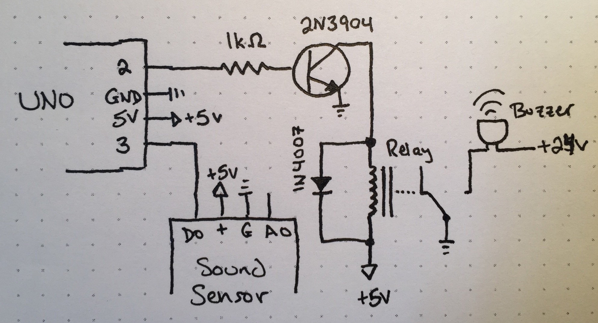

_**Disclaimer:** I don't know what I'm talking about. I'm a JavaScript dev who's just learning this stuff too. I'm sharing what I **think** I learned, but that doesn't make it the truth._

As a former Audio Engineer, I thought it would be fun to play with reading and making sound with Arduino. I bought a couple of sound detection modules and some ultra-loud piezo buzzers, so I thought I would make a simple alarm with them. Reading the sound was simple thanks to the modules, but I wasn't sure how to power the buzzers to their full 24V potential since Arduino outputs a max of 5V.

Seems like my options were using a MOSFET or a relay. I had a relay lying around thanks to the Arduino kit I bought, so that's what I ended up using. Works like a charm, so I thought I would share what I learned!

## The Build


<figcaption>Schematic of the build</figcaption>

### Components

Here are the parts I used for this:

- Arduino Uno R3
- Sound detection module for Arduino
- SRD-05VDC-SL-C relay
- 95db 3-24V piezo buzzer
- 2N3904 NPN transistor
- 1k ohm resistor
- 1N4007 diode

#### Component notes

- Split circuit
  - I don't know if this is the best way, but I basically made two separate circuits that each have their own power and their own ground. So in the schematic, the dotted line next to the relay specifies separate circuits.
  - I use a 24V DC power input that I found at Goodwill with a standard barrel input. That goes through the piezo and is switched on/off by the relay.
  - Everything else is part of the Arduino circuit.
- Sound Detection
  - I'm sure you could use anything for the sound detection module - it seems like they're all clones of one another. I used this [Comidox Sound Detection Module for Arduino](https://www.amazon.com/Comidox-Sensitivity-Microphone-Detection-Arduino/dp/B07J6N734S).
  - It has both analog and digital outputs. Analog gives you a range of values; I didn't use this. Digital gives you a HIGH or LOW based on a threshold controlled by a built-in trim potentiometer.
- Relay
  - The relay is used for switching higher voltage circuits (24V for the buzzer) with logic level controls (5V Arduino).
  - It's strongly encouraged to used a kickback diode with relays. When the relay switches, it can send a short, but very powerful, voltage through the circuit. My understanding is the diode protects the circuit from that voltage. This [video](https://www.youtube.com/watch?v=5kjtiY9gxGM) was a really great look at why you should use one.
  - It was recommended to use a driver circuit for the relay. I tried without it and it sounded like the relay was struggling to switch. The transistor amplifies the current to help with that and the resistor is a current limiting resistor to protect the transistor.
- Buzzer
  - This build could be greatly simplified if you're fine using a 5V buzzer. I wanted it to be really loud though, so I used [this buzzer](https://www.amazon.com/DIKAVS-3-24V-Enclosed-Electronic-Buzzer/dp/B072HRZXLG).
  - To be as loud as possible I needed the voltage (I think), which means I needed the relay, which means I needed the driver circuit.

### Code

``` arduino
// Pin variables
int relay = 2;
int input = 3;

// Variables we need for the logic
int startBeep = 0;
int beepLength = 1000;

void setup() {
  // Set pin direction
  pinMode(relay, OUTPUT);
  pinMode(input, INPUT);
}

void loop() {
  // If we're not currently beeping...
  if (startBeep == 0) {
    // ...and we detect sound...
    int reading = digitalRead(input);
    if (reading == 1) {
      // ...start beep and remember when we started.
      startBeep = millis();
      digitalWrite(relay, HIGH);
      delay(500);
    }
  }
  // Otherwise, if we are currently beeping...
  else {
    // ...and we've been beeping longer than beepLength...
    int now = millis();
    if (startBeep + beepLength < now) {
      // ...reset startBeep and stop beep.
      startBeep = 0;
      digitalWrite(relay, LOW);
      delay(500);
    }
  }
}
```

#### Code notes

The more correct way of doing things would be split `startBeep` into two variables: `startBeep` to track when we started beeping and `isBeeping` to track whether we're currently beeping. I combined those concepts so that if `startBeep == 0` we are not beeping and if `startBeep > 0` we are beeping, while holding when we started beeping. The `millis` function is built in to Arduino and tracks the milliseconds since the sketch started running.

The delays are probably too high, but they're still essential. Without them the piezo doesn't have time to stop beeping before we start reading the sensor input - creating an infinite beep. At 95db, you do not want an infinite loop.

## Conclusion

Despite being a fairly simple project, it took me a lot of time to understand switching on/off circuits with Arduino. This has been several months in the making as I watched just about every video on MOSFETs and relays. I learned a great deal in the process and hopefully will be well prepared for my next, hopefully less abrasive, audio project.