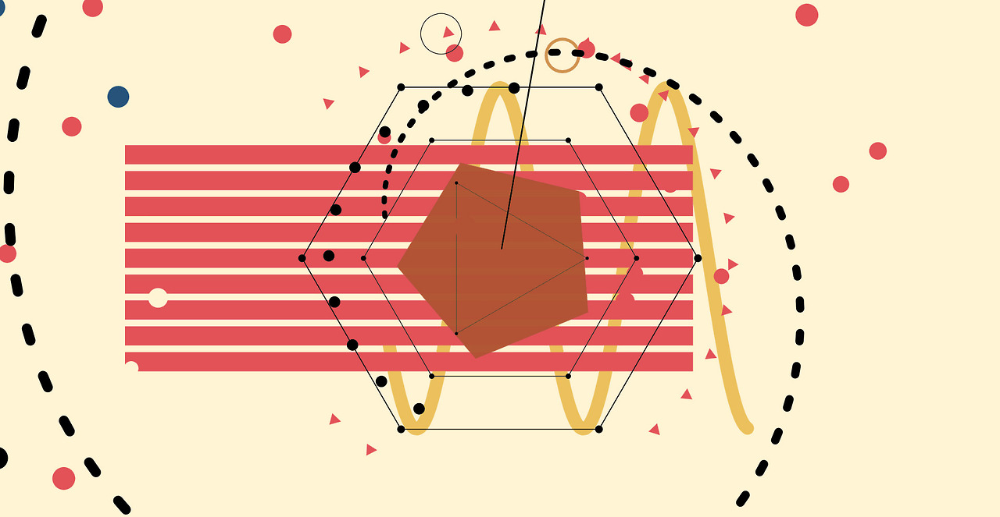
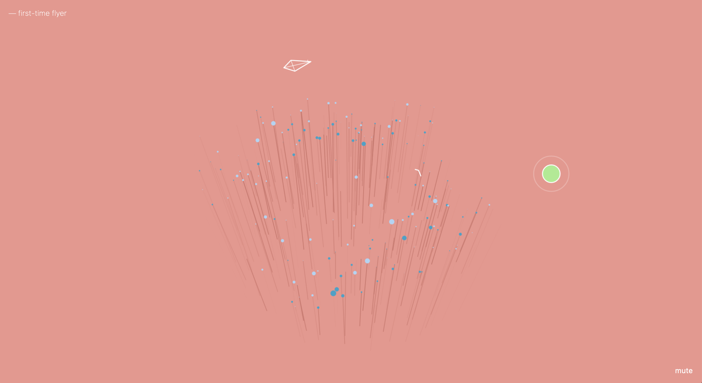
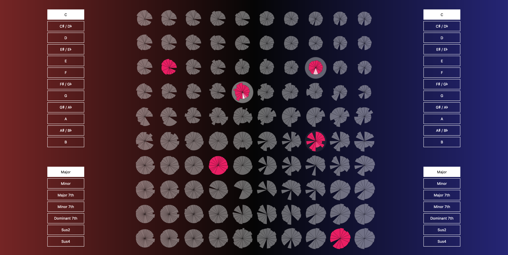
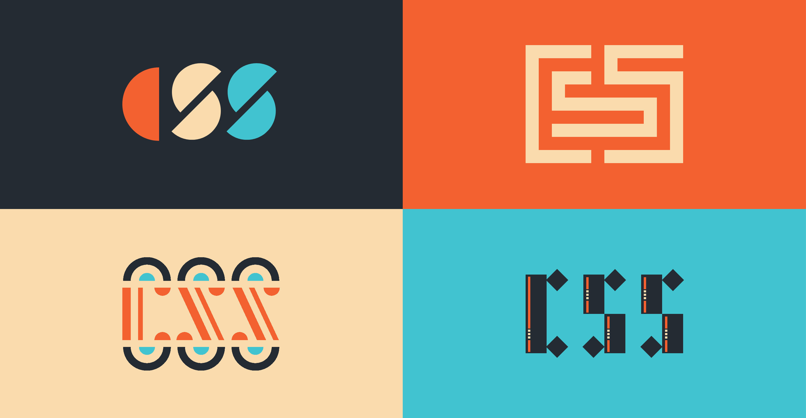

When we think of art we tend to think of New York museums and galleries, people pouring paint onto canvas to the sounds of bebop jazz, or sculptors with rolled up sleeves and clay drying on their faces. We rarely picture computer screens being involved. Alternatively tools available to the artist might come to mind - Photoshop and Illustrator for the visual artists or Ableton and Reason for the sound artists.

We'll be taking a look at a different kind of art. Whereas photo editors might be used to make prints and digital audio workstations might be used to make songs, we'll be looking at art where the program itself is the product.

Specifically we'll be looking through the lense of modern web browsers. Tools for making digital art have been available for decades (some notable examples being Processing and openFrameworks), but people, even people within the web development community, are often surprised by wealth of resources available to us natively in the browser.

## Before We Start

### Why make art with code?

As a general rule, everyone should make art. It's fun, therapeutic, and a great opportunity to join larger communities with similar interests. Everyone has the capacity for arts and crafts, and I'd argue that it's a natural urge intrinsic to all people. By why digital art specifically?

* **It's expressive.** We have the ability to create mixed media, immersive experiences and surprising, generative pieces

* **It's open / distributed.** Open web standards means people around the world can easily access and interact with your art. The web also makes international collaboration a breeze.

* **It's a great way to get better at programming.** Since there's not a ton of information available on creative coding for the web, it's a pastime that forces people to experiment with bleeding edge technology.

* **It can be a viral portfolio piece.** People love quirky web projects, so it's a great way to have your portfolio spread across the web dev community.

* **Not enough people are doing it.** The world needs more web art - it'll make the world better and it will push browsers to prioritize the development of these web standards.

### JavaScript vs. Browser APIs vs. Libraries

JavaScript is a general purpose programming language. It's standards are guided by a committee and includes functionality that is useful to all programming environment (front-end, back-end, embedded, etc). These are things like `if`/`else` statements, `function` declarations, `Array.map`, and `Object.keys`.

Then we have environment specific APIs. It doesn't make sense to try and access GPIO pins from a browser. Similarly it doesn't make sense to try to access DOM nodes in an embedded environment. We'll be talking about Browser APIs - APIs agreed upon by committees usually made up of browser developers. These APIs give web developers access to features built into the browser (usually giving access to code written in lower-level languages such as C++ or Rust).

Finally there are libraries. Libraries are chunks of reusable code that extend JavaScript the language and/or environment APIs. They can be created by anyone, to any specification that they prefer. We'll be talking about these too.

## Artistic Browser APIs

<figcaption>
  <a href="https://patatap.com/" target="_blank" rel="noopener noreferrer">
    Patatap by Jono Brandel
  </a>
</figcaption>

### Canvas API

The Canvas API is an API for "painting pixels" to a digital canvas - typically used for 2D art. It's an extremely versatile and powerful tool for creating and editing raster images (images that are described in pixels). If we were to create a web version of Photoshop or MS Paint, it'd be with the Canvas API.

The name of the API is very indicative of its use and makes for a great analogy. When using the Canvas API, the artist is layering "paint" (in the form of pixels, shapes, and paths) onto the canvas. The canvas can be reused just like a physical canvas can, but the paint layer has to be covered over before starting again.

When looking at the underlying DOM of a Canvas API project, you'll notice there's just a `<canvas>` DOM node. This is a strength and weakness of the API. On the one hand it's good: it means there aren't a lot of DOM nodes to manage so it can be a very performant way to draw graphics or images. On the other hand, since there are no DOM nodes available to us, we aren't able to manipulate specific parts of the image; if we want to change something we have to paint over and redraw the part we want to change.

However due to its performant nature, it's still a great way to animate an image. We can `requestAnimationFrame`, tween the animation, and redraw at around 50 frames per second (FPS depend on a large number of factors). Also thanks to its ability to give us pixel-by-pixel information of the canvas, we're able to do complex image manipulation with the API.

#### P5

[p5](https://p5js.org/) is an open source (LGPL) library created by [Lauren McCarthy](https://twitter.com/laurenleemack) to simplify working with the Canvas API. Probably the most accessible way to get started with creative coding in JavaScript, it handles things like creating the canvas, managing the `canvasContext` (the interface for manipulating the canvas), and requesting animation frames - all while providing helper functions that simplify drawing and math.

It does a lot of other things too, including 3D and sound, so it's possible to build an entire career in digital art just on p5.

<figcaption>
  <a href="https://vimeo.com/282220342" target="_blank" rel="noopener noreferrer">
    Tangara Fastuosa by Sarah GHP
  </a>
</figcaption>

### SVG

Less an API than an addition to the HTML standard, SVG (Scalable Vector Graphics) is a way of describing 2D graphics; in this case vector graphics. Vector images differ from raster images in that rather than describe images on a pixel-by-pixel basis they describe images with shapes primitives. While you might use the Canvas API to make a web equivalent of Photoshop, you'd use the SVG standard to make a web equivalent of Illustrator.

If you know HTML and CSS, you already know SVG. SVG is just a collection of DOM tags that describe shapes that can be styled with CSS. For instance there's a `<circle>` for round ellipses and circles, `<rect>` for squares and rectangles, and `<path>` for arbitrary shapes. They can also contain text or images. Similar to Illustrator, you can group shapes (with the `<g>` tag) to manipulate them together.

Since these are just DOM nodes, they can be animated with CSS transitions or keyframes. More complex behavior can be programmed with JavaScript using `requestAnimationFrame` or an animation library. They can be themed with different CSS classes or resized with CSS media queries.

The strengths and weaknesses foil those of the Canvas API. All the DOM nodes are there to be pushed around or modified, but manipulating the DOM directly is process intensive. We gain flexibility at the cost of performance. This isn't much of a problem for simple graphics, but for complex animations or graphics with hundreds of layers it'll likely be better to use the Canvas API.

#### d3

[d3](https://d3js.org/) is an open source (BSD) library created by [Mike Bostock](https://twitter.com/mbostock) that controls SVG generation and provides useful math functionality. It's used primarily for advanced data visualizations. While d3 should not be someone's first introduction to SVG (SVG is easy enough to get started with directly), d3 is an amazing tool to generate complex graphics and behaviors with SVG.

<figcaption>
  <a href="https://bellwoods.xyz/" target="_blank" rel="noopener noreferrer">
    Bellwoods by Matt DesLauriers
  </a>
</figcaption>

### WebGL

WebGL (Web Graphics Library) is an API for generating 3D graphics in the browser. It is as wonderful as it is difficult. This is no fault of WebGL - 3D graphics are difficult to work with in general. The 3D artist has to account for perspective, lighting, materials, and geometries among many other things. However the payoff for working with WebGL can be immense. While writing this, I took a quick peek at [awwwards](https://www.awwwards.com/) and the first 6 sites they listed were built using WebGL. WebGL is the stuff dreams are made of.

At the most fundamental level, when working directly with WebGL, you'll be working with shaders. Shaders are programs written in a C-like language that determine where each pixel should be in a 3D space and the color the pixel should be based on a number of factors.

While WebGL is pretty standard now, a lot of devices still struggle with it. The fans on most MacBooks will sound like they're lifting off for an interstellar space mission and phones can hang or blow up. Be smart with WebGL and only re-render when there's a reason to re-render. Actually this is just good advice for any type of re-rendering.

I could go on like I know what I'm talking about, but I would recommend skipping right past vanilla WebGL and starting with THREE.

#### THREE

[THREE](https://threejs.org/) is an open source (MIT) library created by [Ricardo Cabello](https://twitter.com/mrdoob) that creates a much friendlier WebGL development experience. THREE gives you constructors for cameras with differing perspectives, geometries/materials/meshes, and different types of lights. It'll handle rendering for you so all you need to manage is animation frames and tweening - things that can be outsourced to animation libraries.

<figcaption>
  <a href="https://codepen.io/teropa/full/rdoPbG" target="_blank" rel="noopener noreferrer">
    Latent Cycles by Tero Parviainen
  </a>
</figcaption>

### Web Audio API

The Web Audio API is a tool useful for playing audio files, analyzing audio, and generating audio. Playing audio has its uses for streaming music or for game development. Analyzing audio can be useful for creating visualizers or for machine learning purposes (think of having a chat bot that you can actually talk to). What excites me the most however is that all modern browser have a fully functioning synthesizer in them!

The API provides low-level building blocks such as `OscillatorNode`, `GainNode`, `BiquadFilterNode`, and `DelayNode` that can be used to create oscillators, envelope generators, amplifiers, filters, delays, and reverbs. Imagine being able to control a big Moog-style modular synthesizer with JavaScript - that's now a reality. 

Working with the Web Audio API can be a little tough, but groups are starting to come together to build web-based digital audio workstations, plugin effect and instrument standards, and experimental projects combining machine learning and browser-specific interfaces. It's likely we'll see something akin to Ableton Live in the browser before too long.

#### Tone

[Tone](https://tonejs.github.io/) is an open source (MIT) library created by [Yotam Mann](https://twitter.com/yotammann) that abstracts away a lot of the low level Web Audio API into virtual modules that can be combined into instruments. In fact, the library comes with several pre-built synths such as a `FMSynth` and a `PolySynth`. It also handles a lot of the general complexity that comes with music programming such as timing and note-to-frequency conversions.

<figcaption>
  <a href="https://a.singlediv.com/" target="_blank" rel="noopener noreferrer">
    A Single Div by Lynn Fisher
  </a>
</figcaption>

### CSS

People like to lament about working with CSS (Cascading Style Sheets), so much so that it's almost a rite of passage in the web dev community. However CSS is amazingly powerful with baked-in support for transitions, animations, and responsive behavior. Now that we have Flexbox and CSS Grid, we have even more tools available to us to create beautiful and responsive pieces without needing to venture into the world or JavaScript.

On top of which making CSS art is a great way to sharpen your web dev skills, and the intrinsic limitations will sharpen your creative muscles.

## Other Browser APIs

There are plenty of other APIs available or soon-to-be available to the artists of the web. Here are a few:

* **Gamepad API:** use a standard video controller to control your game or installation.
* **Web MIDI API:** (Musical Instrument Digital Interface) use a keyboard, drum pad, or other MIDI device to control your web synth or interactive piece.
* **Web Bluetooth API:** an experimental API that could be used trigger interactive elements in an installation.
* **WebXR API:** an experimental API for developing VR (virtual reality) or AR (augmented reality) experiences.

## Machine Learning and Web Art

This is a whole other topic, but I couldn't talk about digital art without bringing up two very cool libraries that help make machine learning available to web artists.

* **[ml5](https://ml5js.org/)** is an open source (MIT) library created by [Hannah Davis](https://twitter.com/ahandvanish) and built on Google's TensorFlow to simplify working with models in the web. Leans more towards visual models.
* **[Magenta](https://magenta.tensorflow.org/)** is an open source (Apache License 2.0) library created by Google and built on Google's TensorFlow. It has several handy composition models leaning towards the audio side of things.

## Additional Resources

* **[The Coding Train](https://www.youtube.com/channel/UCvjgXvBlbQiydffZU7m1_aw)** a great YouTube channel that dives into Processing, p5, and ml5 among other things.
* **[The Book of Shader](https://thebookofshaders.com/)** a free, online book that walks readers through the usage of fragment shaders in WebGL.
* **[Web Audio API](https://webaudioapi.com/book/)** a free, online book that goes through some basic uses for the Web Audio API. Doesn't cover much synthesis, but touches on playback and analysis.

Thanks for reading. If this talk inspired you to try out some Browser APIs in your own creative practice, I'd love to see what you made!