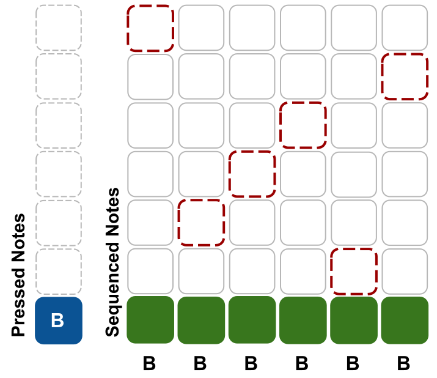
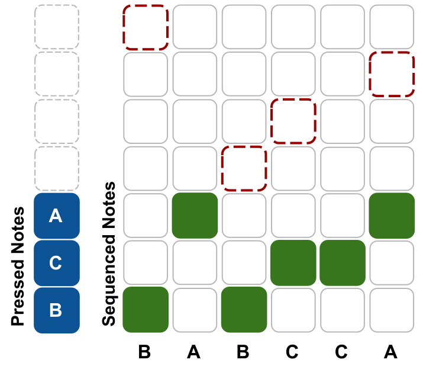
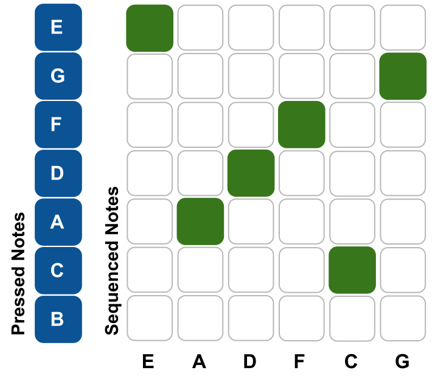

_**Disclaimer:** I don't know what I'm talking about. I'm a JavaScript dev who's just learning this stuff too. I'm sharing what I **think** I learned, but that doesn't make it the truth._

_Project originally inspired by the work of [Mohit Bhoite](https://twitter.com/MohitBhoite)._

_Code references the state as of [this tag](https://github.com/handeyeco/Grandbot/releases/tag/2024-05-01)._

---

## Introduction

So I put Grandbot down for awhile, explored other hobbies, and found my way back to tinkering with electronics. I started looking at open source projects for synths and learned how to design PCBs for my own projects. Realizing I could make a custom PCB for Grandbot (who had been living in a breadboard for years) while also realizing that Grandbot still had a lot of spare memory, I thought I would make Grandbot play synths using MIDI.

I'm not going to waste time explaining [Grandbot](https://github.com/handeyeco/Grandbot), [MIDI](https://en.wikipedia.org/wiki/MIDI), [synthesizers](https://en.wikipedia.org/wiki/Synthesizer), [arpeggiators](https://www.soundonsound.com/techniques/making-most-arpeggiators), or the [circuit](https://github.com/handeyeco/Grandbot/blob/f3aa1b55b50c097ed3ffdcc1509db3f21eb60274/circuit/ALPHA-grandbot-midi/grandbot-midi-schematic.png) (based on [this](https://www.pjrc.com/teensy/td_libs_MIDI.html) and [this](https://www.notesandvolts.com/2015/02/midi-and-arduino-build-midi-input.html)). I'm going to jump straight into explaining how Grandbot's new generative, pattern-based arpeggiator works.

## Concept

Most arps have preset patterns: up, down, up-down, etc. Occasionally arps will have a random setting that's usually chaotic fun albeit a little unmusical. The idea behind Grandbot's arp is essentially: what if we used randomness to generate a sequence and then repeat it to make it more musical. However, as opposed to sequences that are musical intervals relative to a root note, this arp basically stores array indexes to retrieve individual notes from an array of active notes.

Okay some pseudocode (using [MIDI note numbers](https://audiodev.blog/midi-note-chart/) to represent notes):

```JS
// Random arp
// randomly plays one of the four pressed notes
pressed_notes = [60, 64, 67, 71]
while(true) {
    note = random(pressed_notes)
    play(note)
}

// Sequence, relative to a root note
// loops 60 71 64 67
sequence = [0, 11, 4, 7]
pressed_note = 60
while(true) {
    for (interval in sequence) {
        play(pressed_note + interval)
    }
}

// Grandbot
// loops 60 71 67 60
indexes = [4, 7, 2, 12]
pressed_notes = [60, 64, 67, 71]
while(true) {
    for (index in indexes) {
        play(active_notes[index % active_notes.length])
    }
}
```

So that's the basic idea: it's not random notes and it's not a sequence of intervals. It's a randomly selected sequence of indexes used to access an array of notes.

## The data

The above pseudocode is all well-and-good, but I wanted to do a couple of other things with the arp:

- Allow for octaves: we'll use +/- numbers as note offsets (+12 up an octave, -12 down an octave)
- Allow for variation in note lengths: we'll track when a note should start using [MIDI clock pulses](https://en.wikipedia.org/wiki/MIDI_beat_clock) (24 pulses per quarter note)

Let's make the pseudocode a little more realistic:

```JS
current_note = null
current_pulse = -1

pressed_notes = [60, 64, 67, 71]

indexes = [4, 7, 2, 12]
offsets = [0, 0, -12, 0]
start_pulses = [0, 24, 36, 60]

total_length = 84

function handleClock() {
    current_pulse = (current_pulse + 1) % total_length
    step_index = start_pulses.indexOf(current_pulse)

    // return early if we're not on a new step
    if (step_index === -1) return

    if (current_note) stop(current_note)

    // wrap the index in the sequence
    // around the length of pressed_notes
    note_index = indexes[step_index] % pressed_notes.length

    // get the note and apply the octave offset
    current_note = pressed_notes[note_index]
    current_note += offsets[step_index]
    play(current_note)
}
```

That should loop `60 71 55 60` (`60 71 67 60` before the octave transform). It should play it in a `quarter-eighth-quarter-quarter` pattern (in pulses: `24 12 24 24` from 0-83 pulses).

## Generating a sequence

At this point we have most of what we need to generate a new sequence, we just need to add some thresholds for randomness and do the thing. Grandbot stores these randomness threshold values using 7-bit numbers (0-127; since that's what [MIDI messages](https://en.wikipedia.org/wiki/MIDI#Messages) use).

```JS
octave_chance = 20
max_pressed_notes = 16
possible_lengths = [
    6,  // 16th
    12, // 8th
    24  // Quarter
]

indexes = []
offsets = []
start_pulses = []

total_length = 84

function generate() {
    new_length = 0
    step = 0
    while (new_length < total_length) {
        // get a random length from the array of options
        note_length = random(possible_lengths)
        // get a random number between
        // 0 (inclusive) and 16 (exclusive)
        index = random(max_pressed_notes)

        // get a random octave up or down
        offset = 0
        if (random(127) > octave_chance) {
            if (random(2) === 1) {
                offset = 12
            } else {
                offset = -12
            }
        }

        indexes[step] = index
        offsets[step] = offset
        start_pulses[step] = new_length
        new_length += note_length
        step += 1
    }
}
```

Besides handling the actual MIDI messages (I used [Arduino MIDI library](https://github.com/FortySevenEffects/arduino_midi_library)), that's pretty close to all we need.

## Visualizing the note wrapping

Okay, so let's try to make the structure of this a little easier to grok.

Say for each step we pick a random index (in this example `max_pressed_notes` will be 7) but only press one note. Even if the random index _never_ lands on the one note being pressed, it will _always_ play that note.



Now if we do this for a couple of notes, sometimes the index will land on a pressed note and sometime it will have to wrap.



For the last one we press all seven notes available and get the full range of the sequence.



So even though the sequence is the same for all three example, we get three very different results:

1. With only one notes pressed, we always get that one note
2. With only a couple of notes pressed, we sometimes land on a pressed note and sometimes we have to wrap
3. With all notes pressed, we always land on a pressed note and never have to wrap

All of this is happening before we transform the notes with varying rhythms and offsets (i.e. octaves). So even if we only press one note, we could still have a lot of interesting variations.

## Conclusion

The real code for the arp does a lot more, for example:

- Rests
- Fifths
- Ratchets

There's also a fun feature called "Slip" that gently transforms the existing sequence by randomly swapping notes. If you'd like to know more about the project, it's all [open source](https://github.com/handeyeco/Grandbot)! Sharing is caring!
