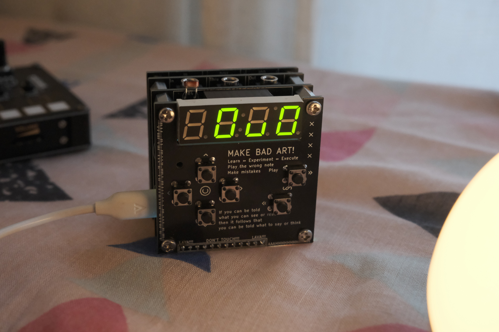
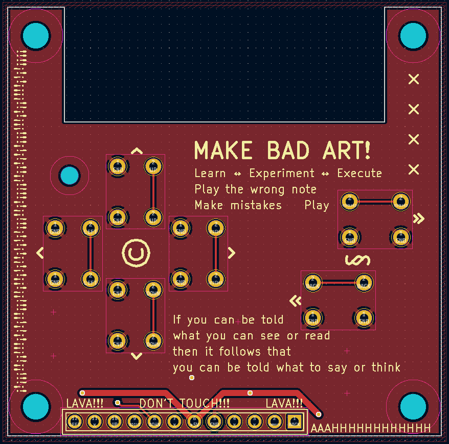
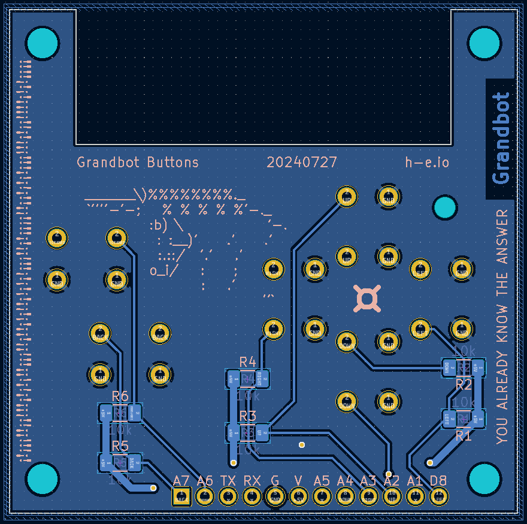

_**Disclaimer:** I don't know what I'm talking about. I'm a JavaScript dev who's just learning this stuff too. I'm sharing what I **think** I learned, but that doesn't make it the truth._

_Project originally inspired by the work of [Mohit Bhoite](https://twitter.com/MohitBhoite)._

---

## Introduction

I've been having a lot of fun adding features to [Grandbot](https://github.com/handeyeco/Grandbot)'s generative sequencer and while each setting is adjustable with MIDI CC, it was becoming a pain in the ass to maintain the different tools I had for sending MIDI CC to Grandbot. I decided to make a menu system and add a new PCB with buttons for navigating the menu.

## The PCB

The PCB is dead simple: 6 buttons. I added some pads on the back in case I wanted to add pull-up resistors, but the Arduino has built-in pull-up resistors so I don't see the point. Debouncing the buttons has been a little bit of a pain (I'll cover that in a bit), so I might eventually add hardware debouncing but that seems like it might be more trouble than it's worth.





Obviously I also needed to expose these pins from the main Grandbot PCB.

## The menu tree

90% of the work was adding the code to support a menu tree ([here's the PR](https://github.com/handeyeco/Grandbot/pull/4)).

- I refactored existing settings into a Setting struct so that settings could be responsible for themselves when it came to things like managing their MIDI CC number, incrementing/decrementing, displaying their name/value, and "rolling the dice" during sequence generation. A lot of this work had to do with mapping 0-127 (the MIDI CC range) into finite steps that made sense for each parameter; for example most chance parameters map 0-127 to 0-99% whereas the MIDI out option needed to map 0-127 to 1-16.
- Then there's the SettingManager which holds a reference to each setting. It triages MIDI CC, but it also maintains the menu state so it knows what parameter to update and when.
- I refactored my original button logic since I went from 1 to 6+1 buttons. There's a Button struct, which handles the individual button state, and a ButtonManager struct, which manages things like button combos.
- Stepper is a utility struct for doing the basic math I was repeatedly struggling with.

The tl;dr of how this all works:

- There's a `menuStage` variable that determines if we're out of the menu (0), choosing a submenu (1), or in either the sequence submenu (2) or the settings submenu (3)
- There's a `menuIndex` variable that determines where in the menu we are
- So when we hit the increment or decrement button:
  - Look at `menuStage` to see which submenu we're in
  - Use `menuIndex` to get a reference to the Setting struct stored in that submenu's array of setting references
  - We tell the Setting to increment or decrement
  - We ask the Setting what should be rendered on the 4D7S display

By offloading a lot of this logic to the Setting structs, we don't have to maintain complicated if/else/switch logic and it's a breeze to add new parameters to the menu.

## Debouncing

Debouncing sucks and it sucks even more when trying to do button combos. My dream was to be able to enter/exit the menu with a combo and to use things like combos to trigger events or speed up increment/decrement actions. I made it happen, but it was a pain!

I ended up using the method explained by [Elliot Williams on Hackaday](https://hackaday.com/2015/12/10/embed-with-elliot-debounce-your-noisy-buttons-part-ii/). Basically what it's doing is maintaining a history of button reads and only considers it a press/release when the history matches a certain expected state. [Here's the PR](https://github.com/handeyeco/Grandbot/pull/8).

``` C++
#define BUTTON_MASK 0b11000111

void Button::read() {
  bool read = digitalRead(pin);

  // Debounce method tracks state over several reads
  history = history << 1;
  history |= (read == false);

  pressed = false;
  released = false;

  // handle press
  if ((history & BUTTON_MASK) == 0b00000111) {
    pressed = true;
    history = 0b11111111;
  }
  // handle release
  else if ((history & BUTTON_MASK) == 0b11000000) {
    released = ignoreRelease ? false : true;
    ignoreRelease = false;
    history = 0b00000000;
  }

  held = history == 0b11111111;
}
```

It works _reasonably_ well, but it can still be a little flaky. Some possible solutions:

- I used a bunch of analog pins on the Arduino for the buttons. I thought it would be nice to expose these pins because it meant that people could make their own custom Grandbot boards and they would be able to use the analog pins as both an analog and a digital input (because you can do `digitalRead` on analog pins). While this _is_ true, apparently analog pins can be slightly slower than digital pins when reading. I'm not confident this is part of the problem, but it's just something I read about while researching the debouncing issues.
- [In part 1 of Elliot's writing on debouncing](https://hackaday.com/2015/12/09/embed-with-elliot-debounce-your-noisy-buttons-part-i/), he talks about adding a resistor and a cap to each button to smooth the transitions from high to low. This wouldn't be the worst thing ever - I could add 6*2 SMT pads to the back of the new PCB - but if you continue reading he also recommends Schmitt-trigger inverter on each button. A single 74HC14 would do the trick (I think) since it has 6 inverters on it...I might still do this, but it's a very small PCB already and adding 12-19 more components would get crowded.

Confusingly it seems to get better or worse depending on some unknown variable. Ultimately though the software debouncing has been working well enough.

## Conclusion

Ultimately the new board has made playing with Grandbot even more fun and the refactored code has made adding features a breeze. Since adding the board:

- Grandbot works with his own MIDI clock now
- I added a button combo for Drift mode (an endless Slip mode)
- I added a button combo for parameter randomization and reset
- There's a 303-style legato parameter
- There's a global output transpose setting

I still have a lot of ideas to come!