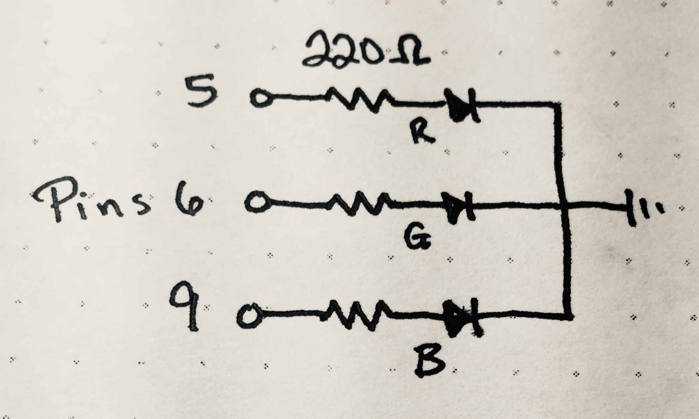

_**Disclaimer:** I don't know what I'm talking about. I'm a JavaScript dev who's just learning this stuff too. I'm sharing what I **think** I learned, but that doesn't make it the truth._

_Project originally inspired by the work of [Mohit Bhoite](https://twitter.com/MohitBhoite)._

_Code references the state as of [this tag](https://github.com/handeyeco/Grandbot/tree/2020-05-15)._

---

The past week has been a big one for the newly named Grandbot project. I finally got to a place where I felt it was time to take a deep dive into C++ and implemented a bunch of new features while learning more about electronics and Arduino programming. Even though the hardware side of things is fairly straightforward, I'm breaking this post into several parts since the code is exponentially more complex now.

I added an RGB LED to let Grandbot emote via light. Red means he's unhappy, otherwise he generates random colors.

## Adding an RGB LED


<figcaption>Schematic of the build</figcaption>

### Components

- Common cathode RGB LED
- 3x 220 Ohm resistors
- Arduino Uno

#### Component notes

An RGB LED is really just three LEDs in one container with a shared cathode. So just like with a regular LEDs, we need current-limiting resistors that will depend on your specific LED. In my case I used 220 Ohm resistors, but you should look into what your LED needs.

### Code

This is just the general idea, not the complete code. There's a link above to the full codebase.

We pass the pins for the different colors to the Grandbot constructor and the constructor initializes an instance of the Light class. Whenever Grandbot updates the expression, he updates the light.

``` Arduino
// main.cpp

// Needs PWM pins
#define redPin 5
#define greenPin 6
#define bluePin 9

// ...set other pins...

Grandbot gb = Grandbot(dataPin, clockPin, loadPin, voicePin, redPin, greenPin, bluePin);

```

``` Arduino
// Grandbot.cpp

Grandbot::Grandbot(int dataPin, int clockPin, int loadPin, int voicePin, int redPin, int greenPin, int bluePin)
  : lc(LedControl(dataPin, clockPin, loadPin)), voice(Voice(voicePin)), light(Light(redPin, greenPin, bluePin)) {
    // ...initializing stuff...
}

void Grandbot::setExpression() {
  expression = Expressions::getExpression(mood);
  writeExpression();
  light.update(mood);
}
```

The Light class is pretty basic right now:

``` Arduino
// Light.h

class Light {
  private:
    // Keeps track of the LED pins
    int red;
    int green;
    int blue;

    void write(int rValue, int gValue, int bValue);
  public:
    Light(int redPin, int greenPin, int bluePin);
    void update(int mood);
};
```

``` Arduino
// Light.cpp

Light::Light(int redPin, int greenPin, int bluePin) {
  red = redPin;
  green = greenPin;
  blue = bluePin;

  // Constructor sets the pins as outputs
  pinMode(red, OUTPUT);
  pinMode(green, OUTPUT);
  pinMode(blue, OUTPUT);
}

void Light::write(int rValue, int gValue, int bValue) {
  // Use analog write (PWM)
  // so we don't just have HIGH and LOW values
  analogWrite(red, rValue);
  analogWrite(green, gValue);
  analogWrite(blue, bValue);
}

void Light::update(int mood) {
  int r = random(0, 256);
  int g = random(0, 256);
  int b = random(0, 256);

  switch(mood) {
    // Off when sleeping
    // (another reason to boot into sleep mode)
    case 0:
      write(0, 0, 0);
      return;
    // Random blue-ish when happy
    case 1:
      write(r, g, 255);
      return;
    // Random color when neutral
    case 2:
      write(r, g, b);
      return;
    // Pure red when unhappy
    case 3:
      write(255, 0, 0);
      return;
  }
}
```

#### Code notes

- It's probably the most basic of the new features.
- Just like Voice, we use a switch based of the current `mood` (stored as an int) to make color selections.

## Conclusion

I would like to do more with this feature. The main improvement I'd like in this department is to add a transition - which would require keeping track of current state and future state, transitioning between the two with some sort of `void transition()` function that can be called continuously in Grandbot's `update` method.

I would also like to have a more specific color palette. For instance I'd like to be able to pick a magenta-ish color. Right now the randomness usually results in green-ish and blue-ish colors.