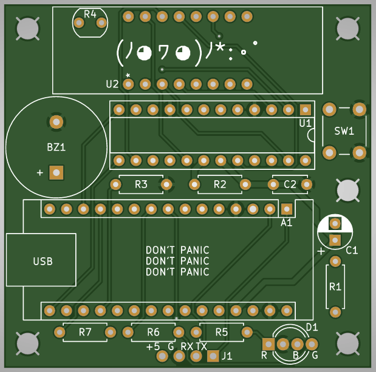
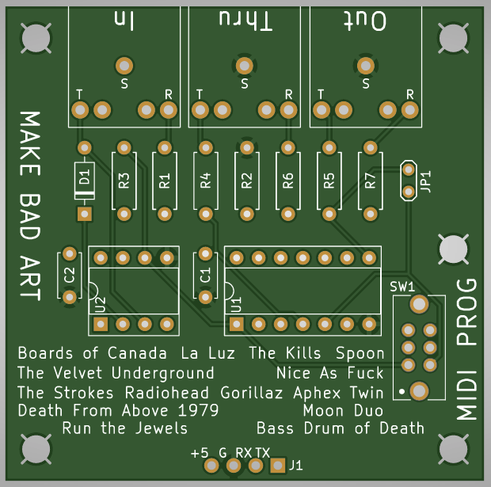
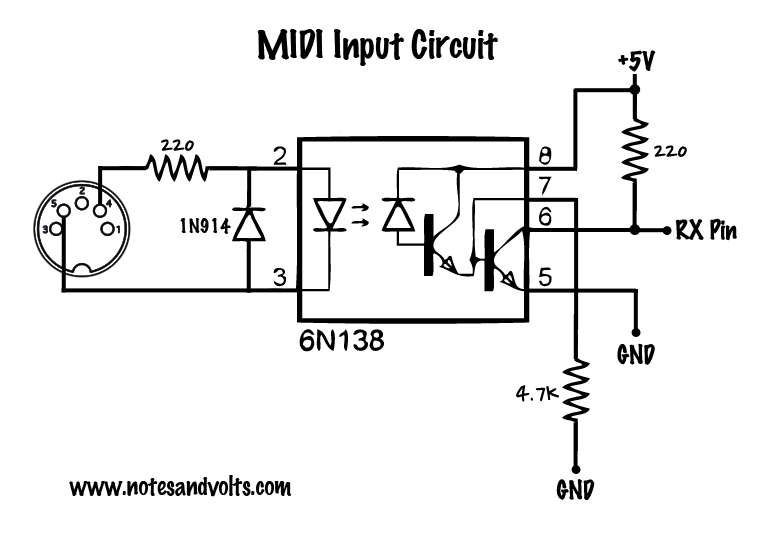

_**Disclaimer:** I don't know what I'm talking about. I'm a JavaScript dev who's just learning this stuff too. I'm sharing what I **think** I learned, but that doesn't make it the truth._

_Project originally inspired by the work of [Mohit Bhoite](https://twitter.com/MohitBhoite)._

_Code references the state as of [this tag](https://github.com/handeyeco/Grandbot/releases/tag/2024-05-01)._

---

Just a couple of random thoughts about Grandbot.

## Custom PCB

Grandbot was looking a little sad in the breadboard and I kept accidentally unplugging things. I thought it was time to move him into a permanent home, so I downloaded [KiCad](https://www.kicad.org/) and [learned](https://www.youtube.com/playlist?list=PLEBQazB0HUyR24ckSZ5u05TZHV9khgA1O) how to make my own PCBs.

After a couple rounds of mistakes, I ended up in a good place. Gerber files are part of the [source](https://github.com/handeyeco/Grandbot) now.

## MIDI

After learning a little about how MIDI works, I thought it would be fun to make Grandbot [play synths](https://handeyeco.github.io/tech-blog/grandbot-update-arp/). In order to do that I needed to have MIDI in and out, so I added an add-on MIDI board.

One inspiration was [PJRC's design for Teensys](https://www.pjrc.com/teensy/td_libs_MIDI.html):

The other was [Notes and Volts design for Arduino](https://www.notesandvolts.com/2015/02/midi-and-arduino-build-midi-input.html):

Some thoughts on the design:

- MIDI In is buffered and sent to MIDI Thru
- MIDI In is also sent to the RX pin on the Nano
- The Nano's TX pin is sent to the MIDI Out
- Using MIDI TRS to save space
- The 6N138 optocoupler is per the MIDI spec to isolate the MIDI In circuit from the outside world
- The 74HC14 inverters are also recommended by the spec, I believe to tighten up the HIGH/LOW signals to prevent noise in the signal
- The jumper is to bypass the 74HC14 is not using MIDI Thru (making the 74HC14 optional)
- The switch is because the Nano shares it's serial TX/RX lines with it's USB connection
  - Both USB and MIDI are serial
  - The Nano only has one serial connection
  - Programming Grandbot while MIDI was active caused connection issues
  - The switch breaks the MIDI connection when set to PROG
  - This is also true for [Sparkfun's MIDI Shield](https://www.sparkfun.com/products/12898)

Gerber files for the MIDI board are also part of the [source](https://github.com/handeyeco/Grandbot) now.

## Arduino Nano vs Arduino Nano Every

I built this whole project using a cheap Arduino Nano clone. It was never really a problem until I got to the Arp/MIDI at which point I couldn't use `Serial.print` anymore because the serial connection was being used by MIDI. Despite not having a way to debug, **_I still continued to use the Nano_** because I am dumb. Talk about painful troubleshooting!

Turns out there's a thing called an Arduino Nano Every that works as a drop-in replacement for the Nano, but with additional serial ports and a ton more memory. I only looked into it at the end of the Arp feature when I surpassed the Nano's memory limits. Ironically I had been using the Nano Every footprint in KiCad the whole time - I just thought it meant "every Nano." 🤦

My understanding is the Nano Every uses different TX/RX connections for USB and pins 1/2 (the pins I had been using for MIDI). That should mean:

- I can `Serial.print` while debugging MIDI
- I don't need the switch on the MIDI board

I haven't confirmed yet though.

Anyway, the positives:

- Official Nano Every is cheaper than the official Nano
- More memory means more steps in the arpeggiator
- Separate serial lines for MIDI and debugging

The negatives:

- Nano clone is cheaper than official Nano Every
- If you're not using the MIDI board, a Nano clone would be fine

So right now I'm trying to continue support for both Nano and Nano Every.