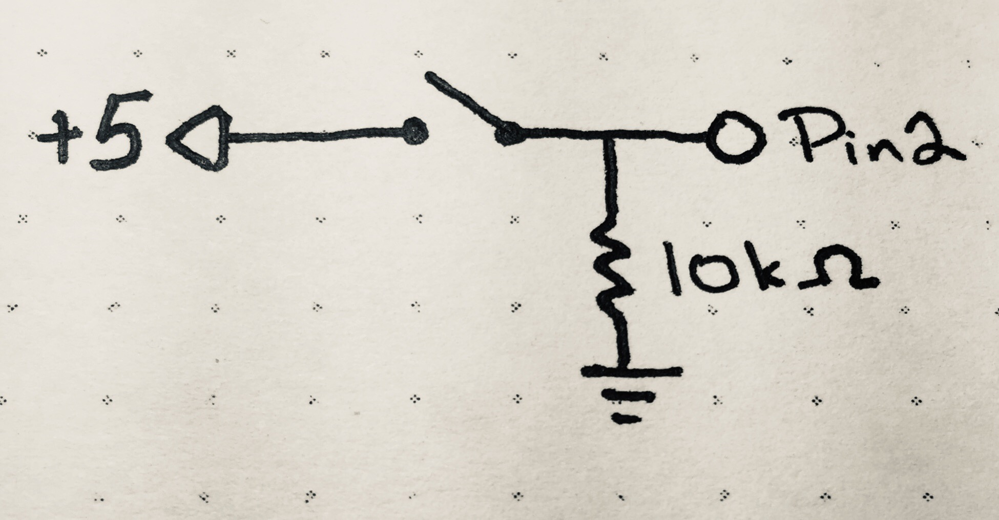

_**Disclaimer:** I don't know what I'm talking about. I'm a JavaScript dev who's just learning this stuff too. I'm sharing what I **think** I learned, but that doesn't make it the truth._

_Project originally inspired by the work of [Mohit Bhoite](https://twitter.com/MohitBhoite)._

_Code references the state as of [this tag](https://github.com/handeyeco/Grandbot/tree/2020-05-15)._

The past week has been a big one for the newly named Grandbot project. I finally got to a place where I felt it was time to take a deep dive into C++ and implemented a bunch of new features while learning more about electronics and Arduino programming. Even though the hardware side of things is fairly straightforward, I'm breaking this post into several parts since the code is exponentially more complex now.

As I mentioned in the last two posts, Grandbot now has "moods" that affect his sounds, expressions, and lights. So how is a mood set? By playing with him of course! Right now the only way to interact with him is with a push button, but hopefully in the future he'll be more interactive.

## Adding a button


<figcaption>Schematic of the build</figcaption>

### Components

- Push button
- 10k Ohm resistor
- Arduino Uno

#### Component notes

There's not much to this one. As far as I understand it, the resistor is a pull-down resistor to prevent the pin from floating when the button is not pressed.

### Code

The code is pretty rough right now, but hopefully the idea is there. I'm not going to show everything, just the button-related stuff.

``` Arduino
// main.cpp

#define playPin 2

// ...set other pins...

Grandbot gb = Grandbot(dataPin, clockPin, loadPin, voicePin, redPin, greenPin, bluePin);

// Used to track the transition
// between on and off
int lastPlayState = 0;

void setup() {
  pinMode(playPin, INPUT);
}

void loop() {
  // Get current state of button
  int playing = digitalRead(playPin);

  // Do different things if button state changed
  if (playing && lastPlayState == 0) {
    gb.play();
    lastPlayState = !lastPlayState;
  } else if (!playing && lastPlayState == 1) {
    lastPlayState = !lastPlayState;
  }
}
```

As I mentioned a previous post, Grandbot's `esteem` is based on how often he's played with, his `mood` is based off his `esteem`, and everything else is based on his `mood`.

``` Arduino
// Grandbot.cpp

class Grandbot {
    private:
        // -1 = uninitialized
        //  0 = sleeping
        //  1 = happy
        //  2 = neutral
        //  3 = unhappy
        int mood = -1;

        // between 0 (unhappiest) and 9 (happiest)
        int esteem = 7;

        void updateEsteem();
        void updateMood();
        unsigned long lastPlayTime = 0;
    public:
        void play();
        void update(int light);
};
```

We want to encourage regular interactions throughout the day, rather than just playing a bunch all at once. So we only bump `esteem` once for every hour of play (3,600,00ms).

``` Arduino
// Grandbot.cpp

void Grandbot::play() {
  unsigned long now = millis();
  unsigned long thresh = lastPlayTime + 3600000LL;

  // If last play was at least an hour ago,
  // bump esteem
  if (now > thresh) {
    lastPlayTime = now;
    // Max esteem is 9
    esteem = min(9, esteem + 1);
  }

  updateMood();
  voice.emote(mood);
}

void Grandbot::updateMood() {
  int last = mood;

  int next;
  if (esteem > 7) {
    next = 1;
  } else if (esteem < 4) {
    next = 3;
  } else {
    next = 2;
  }
  mood = next;

  setExpression();

  if (last != next) {
    // Known bug, double emote
    voice.emote(mood);
  }
}
```

That's the code to make him happier. The code to make him sadder (from being ignored):

``` Arduino
// Grandbot.cpp

// Gets called every loop in main.cpp
void Grandbot::update(int light) {
  unsigned long now = millis();

  // ...sleep related stuff...
  
  // If he's not sleeping or initializing
  if (mood > 0) {
    if (now > nextExpressionChange) {
      updateEsteem();
      setExpression();
      nextExpressionChange = getNextExpressionChange();
    }

    // ...blinking related stuff...
  }

  // ...more sleep related stuff...
}

void Grandbot::updateEsteem() {
  unsigned long now = millis();
  unsigned long thresh = lastPlayTime + 21600000LL;

  // If he hasn't been played with in the last 6 hours
  if (now > thresh) {
    // Need to update this
    // or he'll quickly go from 9 to 0
    lastPlayTime = now;

    // Minimum esteem is 0
    esteem = max(0, esteem - 1);
    updateMood();
  }
}
```

So if you play with him once an hour, his esteem will go up by 1 to a max of 9. If you ignore him for six hours, his esteem will go down by 1 to a min of 0. These values need to be stored somewhere else so they're easy to change.

The bug I ran into was that he kept waking up unhappy. I intentionally skipped updating esteem while he was sleeping, but as soon as he woke up `lastPlayTime` was greater than 6 hours ago. So when he wakes up:

``` Arduino
void Grandbot::wakeup() {
  // So he doesn't wake up angry
  lastPlayTime = millis();

  // ...wakeup stuff...
}
```

It's not a perfect solution, but it works well enough for me.

#### Code notes

- The code really needs refactoring. Even though it works as I would hope, it's a little hard to follow and uses some "magic numbers."
- There's a known bug where if you play with Grandbot and he changes moods, he'll emote twice. Not the worst thing in the world.
- Trying to find the right balance for threshold times is an art not yet mastered. I think six hours is too long, so I'll probably lower that and tweak the esteem-to-mood numbers.
- I only update esteem when updating expressions (`nextExpressionChange`) because the timing isn't that important and I don't want to run it every loop. It's placing is a little confusing, so I may make a new variable like `nextEsteemUpdate` or rename `nextExpressionChange`.

## Conclusion

I'd like to add more interaction that contributes to his mood. Sensing movement, reacting to date/time, and maybe even making mini-games to play with people. For now though, this is a good start on giving Grandbot his own identity. More and more he's controlling his own feelings and I'm just trying to keep up!