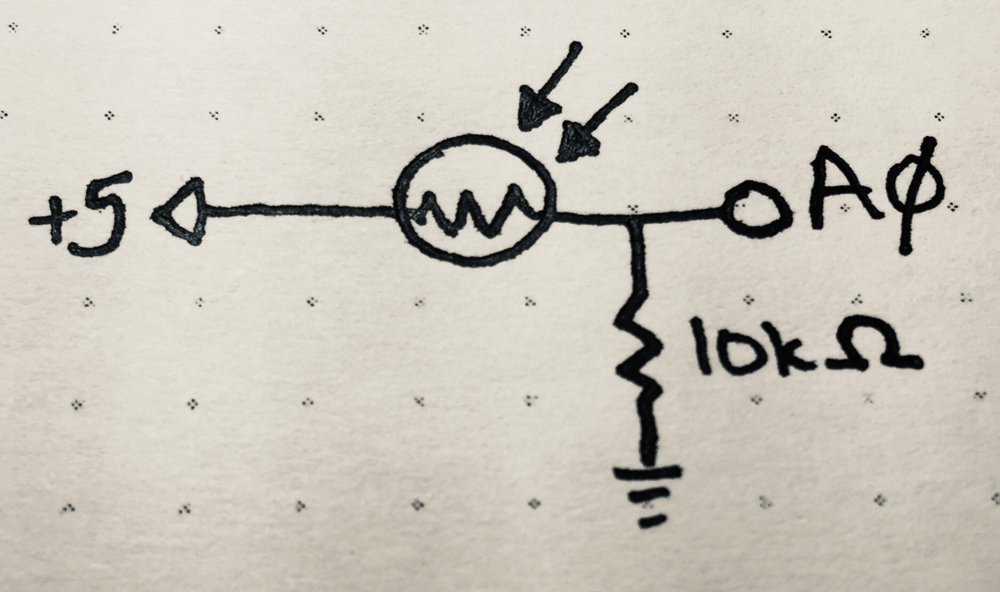

_**Disclaimer:** I don't know what I'm talking about. I'm a JavaScript dev who's just learning this stuff too. I'm sharing what I **think** I learned, but that doesn't make it the truth._

_Project originally inspired by the work of [Mohit Bhoite](https://twitter.com/MohitBhoite)._

_Code references the state as of [this tag](https://github.com/handeyeco/Grandbot/tree/2020-05-15)._

The past week has been a big one for the newly named Grandbot project. I finally got to a place where I felt it was time to take a deep dive into C++ and implemented a bunch of new features while learning more about electronics and Arduino programming. Even though the hardware side of things is fairly straightforward, I'm breaking this post into several parts since the code is exponentially more complex now.

This post is about putting Grandbot to sleep when it gets dark.

## Adding a photoresistor


<figcaption>Schematic of the build</figcaption>

### Components

- Photoresistor (I used an LXD5537; dark 20M Ohm, light 18-50k Ohm)
- 10k Ohm resistor
- Arduino Uno

#### Component notes

For reading different values (rather than just `HIGH`/`LOW`), we have to use an analog input on the Arduino.

The resistor is a pull down resistor. I chose 10k Ohm according to [this guide](https://learn.adafruit.com/photocells/using-a-photocell) because I'm more concerned with darker values. From that page:

> If you're planning to have the sensor in a bright area and use a 10KΩ pulldown, it will quickly saturate. That means that it will hit the 'ceiling' of 5V and not be able to differentiate between kinda bright and really bright. In that case, you should replace the 10KΩ pulldown with a 1KΩ pulldown. In that case, it will not be able to detect dark level differences as well but it will be able to detect bright light differences better. This is a tradeoff that you will have to decide upon

[This page](https://forum.arduino.cc/index.php?topic=18241.0) was also a helpful resource. From it:

> The analogue input is high impedance that means when you connect it to the +5 and the input virtually no current flows. If there is no current flowing through a resistor then there is no voltage drop across it, and so it always reads high.
>
> The pull down resistor makes current flow through the photo resistor and so different light levels result in different currents and hence different voltages (ohms law) which the analogue input can measure.

### Code

The code is still being refined, but the basic idea is that when we're below a "sleep threshold" we should go to sleep and when we're above a "wake threshold" we should wake. It's important that these two thresholds are different. Initially I used a single threshold and when it reached that reading, slight fluctuations in light caused it to continuously switch between on and off. Keeping the two thresholds far away enough from each other allowed the switch to happen without immediately flapping back and forth.

The code grew quite a bit, which is why I linked to the full code above. I'm just going to show the general concept.

``` Arduino
// main.cpp

// Use the Analog 0 pin
#define lightPin A0

// ...set other pins...

Grandbot gb = Grandbot(dataPin, clockPin, loadPin, voicePin, redPin, greenPin, bluePin);

void loop() {
  int light = analogRead(lightPin);

  // Pass the light reading to Grandbot's update method
  gb.update(light);
}
```

``` Arduino
// Grandbot.h

class Grandbot {
    private:
        void sleep();
        void wakeup();

        // -1 = uninitialized
        //  0 = sleeping
        //  1 = happy
        //  2 = neutral
        //  3 = unhappy
        int mood = -1;

        // These thresholds need to be different
        // to prevent flapping between on/off
        static const int wakeThreshold = 200;
        static const int sleepThreshold = 100;
    public:
        Grandbot(int dataPin, int clockPin, int loadPin, int voicePin, int redPin, int greenPin, int bluePin);
        void update(int light);
};
```

``` Arduino
// Grandbot.cpp

void Grandbot::update(int light) {
  boolean awake = light > Grandbot::wakeThreshold;
  boolean asleep = light < Grandbot::sleepThreshold;

  // If mood == sleep and light > wakeThresh: wakeup.
  if (mood == 0) {
    if (awake) {
      wakeup();
    }
  }
  
  // If mood != sleep or uninitialized...
  else if (mood > 0) {
    // ...and light < sleepThresh: go to sleep.
    if (asleep) {
      sleep();
    } else {
      // ...do other stuff here...
    }
  }
  
  // Otherwise we're uninitialized,
  // so we start in sleep mode.
  else {
    sleep();
  }
}

void Grandbot::sleep() {
  // Dim the 4D7S display
  lc.setIntensity(0, 0);

  // Set mood to sleep
  // and update expression
  mood = 0;
  setExpression();
}

void Grandbot::wakeup() {
  // Kickstart blinking
  nextBlink = getNextBlink();
  blinkLength = getBlinkLength();

  // Brighten 4D7S display
  // and update expression
  lc.setIntensity(0, 14);
  updateMood();
}
```

#### Code notes

- We keep track of state in the `mood` variable. The facial expressions, RGB LED colors, and sounds are all derived from `mood` and mood is mostly derived from `esteem` (not shown here; it's based on how often Grandbot is played with). The exceptions are two states: `uninitialized` and `sleeping`.
  - `uninitialized` (-1) is set when booting so I can have special behavior on initial loading.
  - As you see here, `sleep` (0) is based on light input.
- Grandbot wakes up if it's been asleep and if light input is above the `wakeThreshold`. Waking up starts blinking behavior, turns up the brightness of the display, and updates `mood` (based on esteem). I didn't show this, but it also updates `lastPlayTime` so it doesn't wake up unhappy.
- Grandbot goes to sleep if it's uninitialized or if it's in a normal mood and the light reading is below the `sleepThreshold`. Sleep dims the 4D7S display and sets a sleep expression. I didn't show this, but it also plays sleepy music if it's going to sleep from a normal mood (not when it's being initialized).

Hopefully this gets the idea across, but the link to the current state of the code is above. It might clear things up, but it'll probably just make any sane developer sad.

## Conclusion

It's really cute to see Grandbot go to sleep! As I'll write about in other posts, it plays a little tune when going to bed: a random, arpeggiated, Major 7th chord.