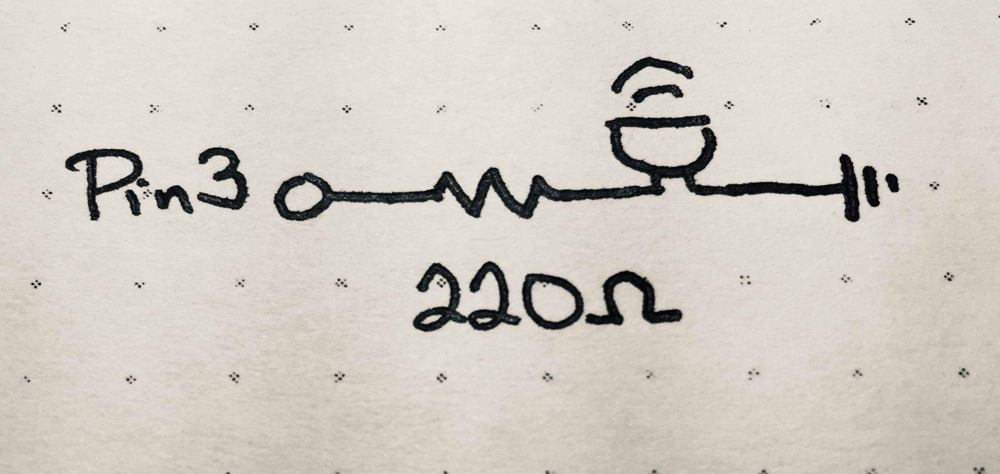

_**Disclaimer:** I don't know what I'm talking about. I'm a JavaScript dev who's just learning this stuff too. I'm sharing what I **think** I learned, but that doesn't make it the truth._

_Project originally inspired by the work of [Mohit Bhoite](https://twitter.com/MohitBhoite)._

_Code references the state as of [this tag](https://github.com/handeyeco/Grandbot/tree/2020-05-15)._

---

The past week has been a big one for the newly named Grandbot project. I finally got to a place where I felt it was time to take a deep dive into C++ and implemented a bunch of new features while learning more about electronics and Arduino programming. Even though the hardware side of things is fairly straightforward, I'm breaking this post into several parts since the code is exponentially more complex now.

This post is about using a passive buzzer to let Grandbot sing randomly generated melodies.

## Adding a buzzer


<figcaption>Schematic of the build</figcaption>

### Components

- Passive buzzer
- 220 Ohm resistor
- Arduino Uno

#### Component notes

I'm using a passive buzzer that came with a kit, but I can't find any part number for it. The datasheet says it's capable of handling 3-12V and its resistance is "16R" (16 Ohms?)

From this thread [this thread](https://forum.arduino.cc/index.php?topic=16262.0):

> According to the buzzer documentation, the 'coil resistance' is 42R +- (plus or minus) 6.3
>
> ohms law: voltage = current * resistance
>
> Other turn-arounds of this formula:
> 
> resistance = voltage / current
> 
> current = voltage / resistance (we're using this one)
>
>Arduino voltage is 5 volts from USB (correct? does this change with plug up to 12v?)
>
> 5 volts / 42R = .119A, or 119mA: That's 79mA too much current.
>
> To fix:
>
> 100R resistor + 42R buzzer = 142R
>
> 5v / 142R = .0352Am, or 35.2mA: That's less than the 40mA of the Arduino AVR: Success!

So for me `5V / 16R = .312A`. 312mA > 40mA, so I need to limit the current. I added 220 Ohms: `5V / (16R + 220) = .021A`. 21mA < 40mA, so we're good to go! I could have used less resistance, but I'm fine with the buzzer being a little quieter.

### Code

This is just the general idea, not the complete code. There's a link above to the full codebase.

The code uses an array of pitches and the Tone library to create little melodies based on Grandbot's mood. I want to improve the different mood sounds, but right now he plays the same two low frequencies when unhappy, a random note when in a neutral mood, a series of random notes when happy, and a random Major 7th chord when going to sleep.

It's all pretty straightforward, the only tricky part was getting true randomness. Arduino's `random` function is a pseudorandom number generator, so Grandbot kept playing the same tunes. The solution was to use a floating analog pin as a seed.

``` Arduino
// main.cpp

// Pin connected to buzzer
// (needs to be a PWM pin)
#define voicePin 3

// Leave unconnected
#define randomPin A5

// ...set other pins...

Grandbot gb = Grandbot(dataPin, clockPin, loadPin, voicePin, redPin, greenPin, bluePin);

void setup() {
  randomSeed(analogRead(randomPin));
}
```

Then we have a `Voice` class:

``` Arduino
// Voice.h

class Voice {
  private:
    int m_voicePin;
    static const int pitches[];
    void playMajor7th();
    void playRandomSequence();
    void playRandomNote();
    void play(int note);
    void play(int note, int duration);
  public:
    Voice(int voicePin);
    void feedback();
    void emote(int mood);
};
```

This has some helper functions for using Tone:

``` Arduino
// Voice.cpp

void Voice::play(int note) {
  play(note, 75);
}

void Voice::play(int note, int duration) {
  tone(m_voicePin, note);
  delay(duration);
  noTone(m_voicePin);
}
```

An array of pitches:

``` Arduino
// Voice.cpp

const int Voice::pitches[28] = { 
  1047, 
  1109, 
  1175,
  // ...etc...
  4435, 
  4699, 
  4978 
};
```

Some internal sound making fun:

``` Arduino
// Voice.cpp

void Voice::playMajor7th() {
  int duration = 250;

  // Pick the chord's starting note
  int start = random(0, 12);

  // Step through the Major 7th intervals
  play(pitches[start], duration);
  play(pitches[start+4], duration);
  play(pitches[start+7], duration);
  play(pitches[start+11], duration);
}

void Voice::playRandomSequence() {
  int len = random (3, 10);
  for (int i = 0; i < len; i++) {
    playRandomNote();
  }
}

void Voice::playRandomNote() {
  int rand = random(0, 28);
  int note = Voice::pitches[rand];
  play(note);
}
```

I've since found a better way to get a random entry from an array in C++ (by first determining array length), but this has been working for now.

Last in this file are two public methods:

``` Arduino
// Voice.cpp

// Chirp when we want feedback
// (not currently in use)
void Voice::feedback() {
  playRandomNote();
}

// Play a melody based on mood (stored as an int)
void Voice::emote(int mood) {
  switch(mood) {
    // Sleeping
    case 0:
      playMajor7th();
      return;
    // Happy
    case 1:
      playRandomSequence();
      return;
    // Neutral
    case 2:
      playRandomNote();
      return;
    // Unhappy
    case 3:
      play(200, 1000);
      play(100, 1000);
      return;
  }
}
```

Grandbot stores an instance of Voice and calls it from time-to-time.

``` Arduino
Grandbot::Grandbot(int dataPin, int clockPin, int loadPin, int voicePin, int redPin, int greenPin, int bluePin)
  : lc(LedControl(dataPin, clockPin, loadPin)), voice(Voice(voicePin)), light(Light(redPin, greenPin, bluePin)) {
    // Initializing stuff
}

void Grandbot::updateMood() {
  int last = mood;
  int next;

  // ...determine next mood...

  mood = next;

  if (last != next) {
    voice.emote(mood);
  }
}

void Grandbot::sleep() {
  // ...sleep stuff...

  // So we don't play a sound
  // if we reset at night
  if (lastMood >= 0) {
    voice.emote(mood);
  }
}

void Grandbot::play() {
  // ...playful stuff...

  updateMood();
  voice.emote(mood);
}
```

#### Code notes

- I should probably have a separate Pitch file.
- Randomly selecting things should be done by determining the array length, rather than using a hard-coded value.
- I'd like to add more functions for specific chords and then auto-generate small chord progressions. I also think this is a good foundation for a game to play with Grandbot (like Simon).
- The instance of Voice created in the Grandbot constructor is made with an initializer list. The compiler threw an error because I didn't have a default constructor for Voice, so I just initialized it in the initializer list. I'm not sure if there was something else I should have done.
- I'm considering creating the class instances outside of Grandbot and handing them to Grandbot's constructor rather than creating them in the constructor. The downside is I wouldn't be able to run to Grandbots on one Arduino that way. 🤷‍♀️

## Conclusion

Really love his random sequences. The Major 7th chord is pretty, but the random sequence makes it seem like he's trying to communicate. I do want to make the neutral response better though, it's a little boring right now.

Another problem is that using `delay` for note length blocks the thread. For instance the sleep melody is 4 notes at 250ms; that means nothing else can happen for the 1 second it's playing that tune. Not sure if there's a pay to pass this functionality to an external IC like I did with multiplexing the 4D7S display.