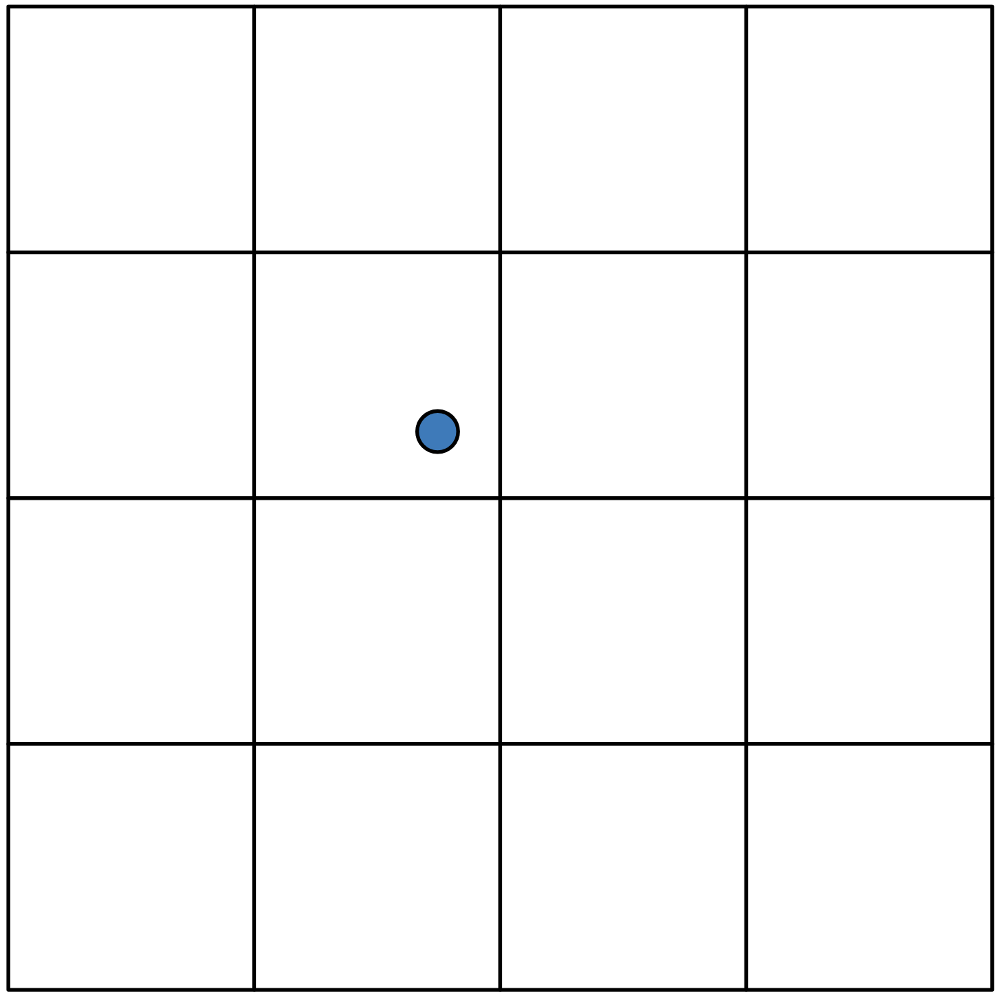
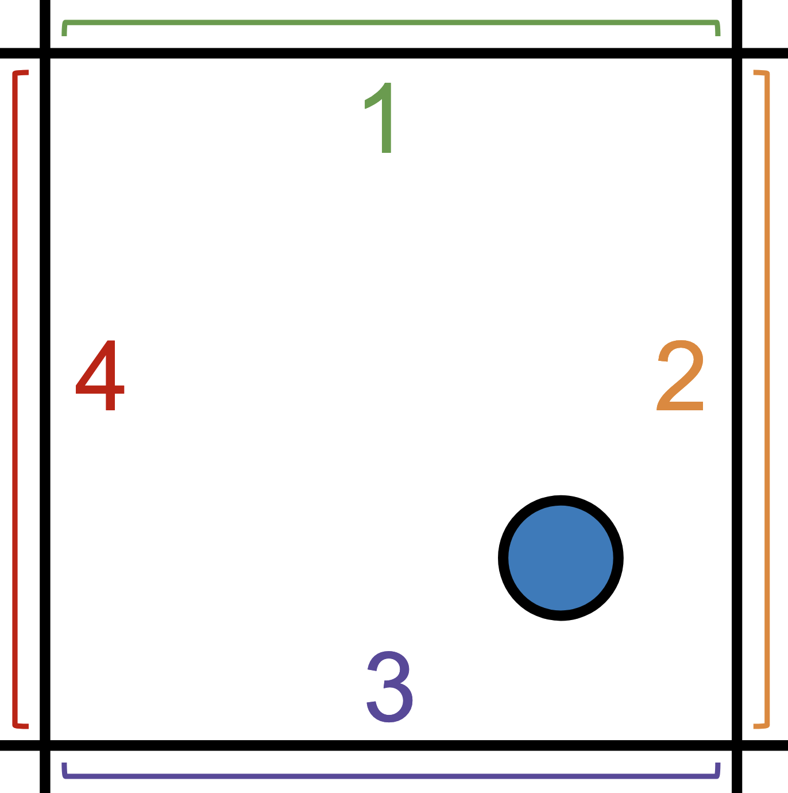
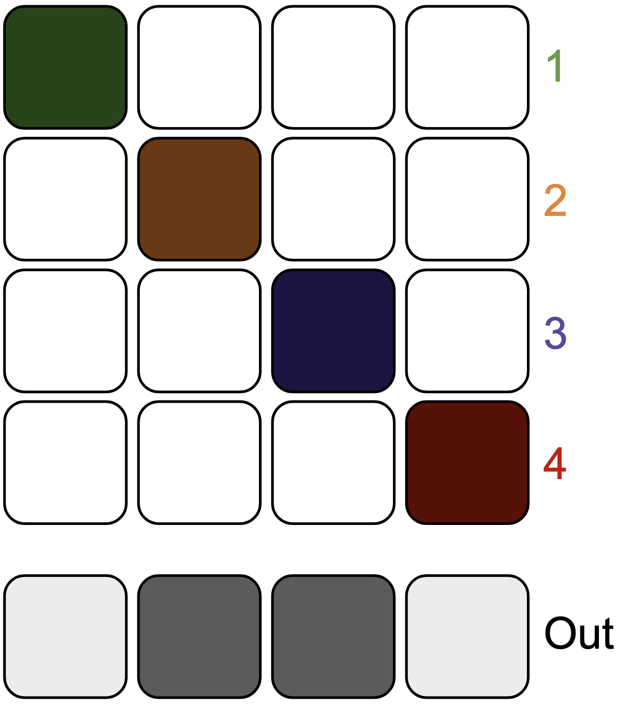
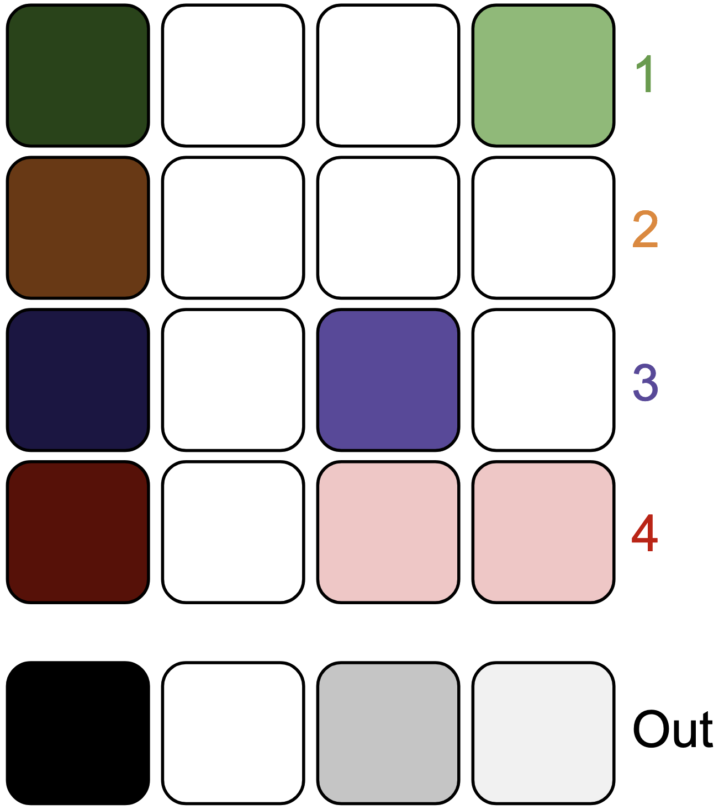
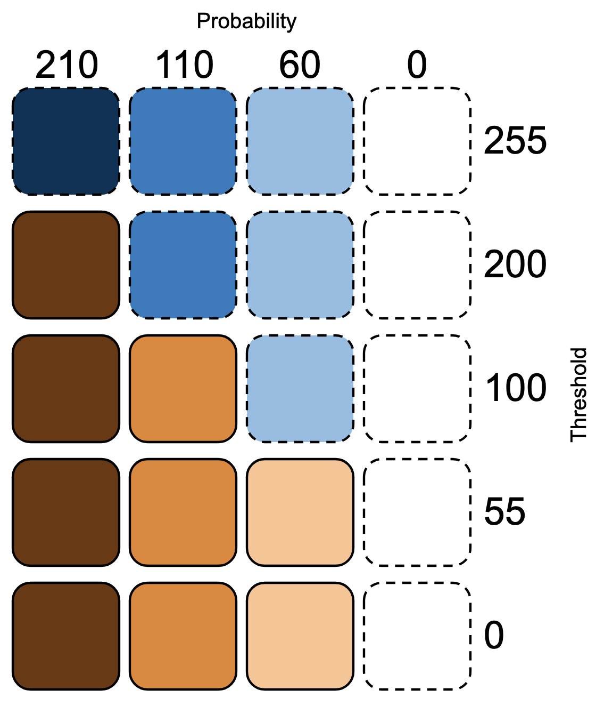

I've been having a lot fun building a generative melody sequencer for [Grandbot](https://github.com/handeyeco/Grandbot) and have started looking at other ways to algorithmically generate parts of music. Passing Grandbot's output through my [norns-ripchord](https://github.com/handeyeco/norns-ripchord/) has been useful for generating chord progressions and, by using a sampler, I can repurpose Grandbot's output to trigger chopped breakbeats for some glitchy D'n'B style drums.

At one point though I had an idea: what if I took a collections of drum patterns and used them to generate a dataset of probabilities - not a collection of _sequences_, but a collection of probabilities that could be used to generate novel sequences based on the likelihood that a specific drum would play at a specific step. I knew I would need patterns, that I would need to normalize the data, that this sounded a little like how machine learning works, and...well it all just seemed like a lot of work and maybe a little beyond my skill set.

So how surprised was I when I discovered [Mutable Instruments Grids](https://pichenettes.github.io/mutable-instruments-documentation/modules/grids/) ([source](https://github.com/pichenettes/eurorack/tree/08460a69a7e1f7a81c5a2abcc7189c9a6b7208d4/grids)). This is almost exactly how Grids works. Grids is a 5x5 set of pattern probabilities (so 25 patterns) with each pattern containing 32 steps for 3 instruments (bass drum, snare drum, and hi hat); this 5x5 coordinate system is traversed using an X/Y location with the 4 patterns surrounding the X/Y point being combined through a 2D crossfade.

Before I go any further, I just want to shout out two people: Émilie Gillet (aka pichenettes) who founded Mutable Instruments and who gave one of the greatest gifts ever be given to the Synth DIY scene by open-sourcing her work. Also a big thank you to Adam Thomas (aka devdsp) who who did a [visualization of Grids](https://devdsp.com/grids.html) - one that I borrowed and added to. You can [find my version here](https://handeyeco.github.io/mi-grids-viz/).

## Understanding Grids

Before we get too technical, let's talk about what Grids is doing. Grids is called a "topographic drum sequencer" because it's working on a 2D map using the concept coordinates (X/Y point) to traverse this map. Kind of like this:



Okay, so I don't know whether to call this a 5x5 or 4x4 grid; the lines represent the 25 drum patterns (5x5) but the coordinates exist within the 4x4 space between lines. If I make a mistake, chalk it up to a classic off-by-one error. Anyway let's zoom in:



This point exists in a space between 4 drum patterns - or rather drum _probability_ patterns. These probability patterns are blended together based on the position of the X/Y point. In this case it will be affected by all 1-4 patterns, but it will be affected by 2 and 3 more than 1 and 4.

To illustrate this, let's look at just 4 steps of one of the three instruments while pretending that each pattern has its own step. Note that each pattern's step is a dark color (indicating a high probability) but that the outputs for 2 and 3 are darker than 1 and 4 (indicating a bias towards 2 and 3 probabilities). However the steps for 1 and 4 still have _some_ probability.



Now let's look at a more likely example. In the next diagram:

1. All patterns have a high probability for step 1 which means the output for step 1 has a high probability.
2. Similarly, all patterns have a 0% chance probability for step 2, so the output for step 2 has a 0% probability.
3. Pattern 3 has a medium probability for step 3, pattern 4 has a low probability, and patterns 1 and 2 have a 0% chance; I didn't do that math, but that should result in a low-to-medium probability since pattern 3 pulls it up and pattern 2 pulls it down.
4. Finally step 4 output is a very low probability because patterns 1 and 4 have some probability, but that's brought down by patterns 2 and 3 having a 0% probability.



So which notes play? That's where the "fill" control comes in. Fill is basically a threshold for triggering a gate. If the output probability is higher than the fill threshold, the gate is triggered. In the next diagram, I'll indicate notes that don't play with blue and notes that do play with orange. The probabilities stay the same each time, but as the threshold drops more notes play.



Just a disclaimer, this is more meant to be a conceptual example not a precise description of how the code works. Anyway let's recap the ideas:

- We have 25 (5x5) drum probability patterns that are formed to create a 4x4 grid
- We traverse this grid using an X and Y position
- We blend the 4 patterns that surround the X/Y position in a way that's biased towards the patterns we're closest to
- We read steps from this blended probability pattern and compare each step to a threshold to determine whether or not the step should trigger a gate
- We do this for 32 steps for 3 instruments (sharing the X/Y coordinate but with each instrument having its own fill setting)

If things still aren't clicking, play around with the visualizer that Adam Thomas made and which I modified to add a visualization of the coordinate grid: [here's that link again](https://handeyeco.github.io/mi-grids-viz/).

Whew that was a lot. What's this blog post about again? Right, bit shifting.

## Understanding Grids' bit shifting

At this point you might be thinking we're about to dig into an encyclopedia's worth of code in order to work in this blended, multi-dimensional space - at least that's what I was thinking. If so, you'll be surprised to discover that the reading/blending code is relatively concise (if a little opaque).

I'm sure a lot went into the machine learning data crunching, but accessing and blending the data can be cleverly done with a few lines of code thanks to some [bitwise operators](https://en.wikipedia.org/wiki/Bitwise_operation). Coming from JavaScript this was a novel idea - it's rare that we need the speed or control that bit manipulation offers and numbers in JS are floats anyway so it's not as straightforward as it is in C++.

Let's look at the code. First we'll make the 5x5 grid:

``` cpp
// pattern_generator.cc

static const prog_uint8_t* drum_map[5][5] = {
  { node_10, node_8, node_0, node_9, node_11 },
  { node_15, node_7, node_13, node_12, node_6 },
  { node_18, node_14, node_4, node_5, node_3 },
  { node_23, node_16, node_21, node_1, node_2 },
  { node_24, node_19, node_17, node_20, node_22 },
};
```

Each node here is is an array of 96 probabilities - 3 instruments (BD, SD, HH) times 32 steps - and each probability is represented as a byte (0-255). Now we'll read a specific step (0-31), for a specific instrument (0-2), for a specific X/Y position (0-255 / 0-255):

``` cpp
// pattern_generator.h

const uint8_t kStepsPerPattern = 32;

// pattern_generator.cc

uint8_t PatternGenerator::ReadDrumMap(
    uint8_t step,
    uint8_t instrument,
    uint8_t x,
    uint8_t y) {
  uint8_t i = x >> 6;
  uint8_t j = y >> 6;
  const prog_uint8_t* a_map = drum_map[i][j];
  const prog_uint8_t* b_map = drum_map[i + 1][j];
  const prog_uint8_t* c_map = drum_map[i][j + 1];
  const prog_uint8_t* d_map = drum_map[i + 1][j + 1];
  uint8_t offset = (instrument * kStepsPerPattern) + step;
  uint8_t a = pgm_read_byte(a_map + offset);
  uint8_t b = pgm_read_byte(b_map + offset);
  uint8_t c = pgm_read_byte(c_map + offset);
  uint8_t d = pgm_read_byte(d_map + offset);
  return U8Mix(U8Mix(a, b, x << 2), U8Mix(c, d, x << 2), y << 2);
}

// In a shared utility repository

uint8_t U8Mix(uint8_t a, uint8_t b, uint8_t balance) {
  return a * (255 - balance) + b * balance >> 8;
}
```

If you look at this and think "yeah, that makes sense" then I wasted your time. I'm sorry. The rest of this article is just going to explain these 20-ish lines of code.

First let's describe this with pseudocode:

1. We declare a function called `ReadDrumMap` that accepts 4 bytes: `step`, `instrument`, `x`, and `y`.
2. We use `x` and `y` to get indices (`i` and `j`) that we then use to get pointers to 4 patterns from `drum_map`.
3. Since each node in `drum_map` is an array of 96 probabilities and each of the three instruments takes up 32 of those 96 slots, we multiply `instrument` by `kStepsPerPattern` (32) and then apply the `step` offset to get our final index `offset`.
4. We then get the probability for that instrument/step from each of the 4 patterns (`a` - `d`).
5. Finally we blend the 4 bytes representing the 4 probabilities into 1 byte.

But wtf is `x << 2`? How does `x >> 6` convert a byte into a 0-3 index? Why do we need `>> 8` at the end of `U8Mix`? This is the power of bit-shift operators. 🌈

### Mapping 0-255 to 0-3

The first bit-shift operation we hit is `uint8_t i = x >> 6;`.

We know that `x` and `y` are values between 0 and 255, but we want to map this to 0-3 to get our first x- and y-patterns from `drum_map` (which we can use to get our second x- and y-patterns by adding 1 to the indices). What I probably would have done was use Arduino's map:

``` cpp
long map(long x, long in_min, long in_max, long out_min, long out_max) {
  return (x - in_min) * (out_max - out_min) / (in_max - in_min) + out_min;
}

map(x, 0, 255, 0, 3)
```

However, division is pretty inefficient which could be a problem in time-sensitive applications. Here's a quote from Émilie that hints at her motivation for using bit shifting:

> ...you need to divide by 255 instead of shifting by 8, and what took 1 CPU cycle will suddenly take 40+
> 
> ([source is on my visualizer clone](https://handeyeco.github.io/mi-grids-viz/))

That's where bit shifting comes in. But what does a right shift do? Let's look at some code.

``` cpp
byte a = 0;   // decimal 0   is 00000000 as a binary byte
byte b = 64;  // decimal 64  is 01000000
byte d = 128; // decimal 128 is 10000000
byte e = 192; // decimal 192 is 11000000
byte f = 255; // decimal 255 is 11111111

255 >> 0; // 11111111
255 >> 1; // 01111111
255 >> 2; // 00111111
255 >> 7; // 00000001
255 >> 8; // 00000000
```

Some things to note:

1. Bit-shifting right moves all of the existing bits right, drops the right-most bit, and prepends the byte with a 0.
2. As we move from 0 to 255, the left-most two bits have 4 distict states: `00`, `01`, `10`, and `11`.
3. Counting 4 steps is exactly what we need.

So enough being coy, let's do the thing.

``` cpp
  0 >> 6; // 00000000 becomes 00000000 = 0
 64 >> 6; // 01000000 becomes 00000001 = 1
128 >> 6; // 10000000 becomes 00000010 = 2
192 >> 6; // 11000000 becomes 00000011 = 3
```

Since bit-shifting right drops the right-most bits and prepends the byte with 0, we will always end up with 0-3 when keeping only two of the bits. By using the most significant bits (MSB), 0-3 maps fairly evenly across 0-255

### Reclaiming 6 bits

While we want to be able to blend our 5x5 grid, we don't just want 16 (4x4) steps of resolution - that'd be boring! `x` is 0-255 and `y` is 0-255, so we _should_ have 65,025 possibilities. So that's why we blend between patterns. However we're already using 2 bits for the indicies.

Here's where the next shift happens: `x << 2`. With a left bit shift, we drop the left-most bit and add a 0 to the right of the byte.

``` cpp
255 << 0; // 11111111
255 << 1; // 11111110
255 << 2; // 11111100
255 << 7; // 10000000
255 << 8; // 00000000

  1 << 2; // 00000001 becomes 00000100 = 4
  2 << 2; // 00000010 becomes 00001000 = 8
  3 << 2; // 00000011 becomes 00001100 = 12
253 << 2; // 11111101 becomes 11110100 = 244
254 << 2; // 11111110 becomes 11111000 = 248
255 << 2; // 11111111 becomes 11111100 = 252
```

Note that it moves in increments of 4 when we shift by 2, which gives us 64 steps between 0 and 255. However this is 64 steps _per_ section in the 4x4 grid; 64*4 is 256 which is the number of steps from 0-255. We're back baby!

So `x >> 6` helps us break 0-255 into 0-3 and `x << 2` helps us get a 64 step resolution within a single section of the 4x4 grid. Together they let us traverse seemlessly while also letting us access the `drum_map` gracefully.

### Scaling up, scaling down

This final bit of bit shifting is `balance >> 8` in `U8Mix`. For that it's useful to look at the whole function again:

``` cpp
uint8_t U8Mix(uint8_t a, uint8_t b, uint8_t balance) {
  return a * (255 - balance) + b * balance >> 8;
}
```

It's a crossfade between `a` and `b` where `balance` is the mix between the two. They're all bytes, so they all have a range between 0 and 255.

``` cpp
U8Mix(0, 255, 0);
// 255 - balance = 255 - 0 = 255
// a * 255 = 0 * 255 = 0
// b * balance = 255 * 0 = 0
// 0 + 0 = 0
// 00000000 >> 8 = 00000000
// U8Mix(0, 255, 0) = 0

U8Mix(0, 255, 255);
// 255 - balance = 255 - 255 = 0
// a * 0 = 0 * 0 = 0
// b * balance = 255 * 255 = 65025
// 0 + 65025 = 65025
//     65025 is bigger than a byte!!!
//     We need two bytes to represent it
// 1111111000000001 >> 8 = 11111110
// U8Mix(0, 255, 255) = 254

U8Mix(37, 145, 36);
// 255 - balance = 255 - 36 = 219
// a * 219 = 37 * 219 = 8103
// b * balance = 145 * 36 = 5220
// 8103 + 5220 = 13323
//     13323 is bigger than a byte!!!
//     We need two bytes to represent it
// 0011010000001011 >> 8 = 00110100
// U8Mix(37, 145, 36) = 52
```

So here's what's happening:

1. We scale `a` up by the inverse of balance
2. We scale `b` up by balance
3. We add the two scaled numbers up, which may exceed a byte
4. We shift the whole thing right by 8 bits, which scales the number back down to a byte

So in a sense, `n >> 8` is an imperfect equivalent of `n / 256`, one that's close enough to use in exchange for the added performance boost that comes from avoiding division.

## The whole thing

So let's go through the whole thing.

``` cpp
ReadDrumMap(
    2  // step (0-31)
    2  // instrument (0-2)
    89 // x (0-255)
    30 // y (0-255)
);
```

We'll immediately hit the first bit shift:

``` cpp
  uint8_t i = x >> 6;
  // 89 >> 6 = b01011001 >> 6 = b00000001 = 1

  uint8_t j = y >> 6;
  // 30 >> 6 = b00011110 >> 6 = b00000000 = 0
```

We can use those numbers to access `drum_map` now:

``` cpp
  const prog_uint8_t* a_map = drum_map[i][j];
  // drum_map[i][j] = drum_map[1][0] = node_15

  const prog_uint8_t* b_map = drum_map[i + 1][j];
  // drum_map[i + 1][j] = drum_map[2][0] = node_18

  const prog_uint8_t* c_map = drum_map[i][j + 1];
  // drum_map[i][j + 1] = drum_map[1][1] = node_7

  const prog_uint8_t* d_map = drum_map[i + 1][j + 1];
  // drum_map[i + 1][j + 1] = drum_map[2][1] = node_14
```

Now we calculate the offset to access the specific probabilites. Note that `a_map` is a pointer to the first byte of the array; the address tells us where to look for the array and incrementing it tells us where in the array to look.

``` cpp
  uint8_t offset = (instrument * kStepsPerPattern) + step;
  // offset = (2 * 32) + 2 = 64 + 2 = 66

  uint8_t a = pgm_read_byte(a_map + offset);
  // node_15[66] = 28

  uint8_t b = pgm_read_byte(b_map + offset);
  // node_18[66] = 0

  uint8_t c = pgm_read_byte(c_map + offset);
  // node_7[66]  = 72

  uint8_t d = pgm_read_byte(d_map + offset);
  // node_14[66] = 8
```

Then blend the four probabilities:

``` cpp
  return U8Mix(U8Mix(a, b, x << 2), U8Mix(c, d, x << 2), y << 2);

  // U8Mix(a, b, x << 2) =
  //     U8Mix(28, 0, 89 << 2) =
  //     U8Mix(28, 0, b01011001 << 2) =
  //     U8Mix(28, 0, b01100100) =
  //     U8Mix(28, 0, 100)
  // a * (255 - balance) + b * balance >> 8 =
  //     28 * (255 - 100) + 0 * 100 >> 8 =
  //     28 * 155 + 0 >> 8 =
  //     4340 >> 8 =
  //     b0001000011110100 >> 8 =
  //     b00010000 = 16

  // U8Mix(a, b, x << 2) = 
  //     U8Mix(72, 8, 89 << 2) =
  //     U8Mix(72, 8, b01011001 << 2) = 
  //     U8Mix(72, 8, b01100100) =
  //     U8Mix(72, 8, 100)
  // a * (255 - balance) + b * balance >> 8 =
  //     72 * (255 - 100) + 8 * 100 >> 8 =
  //     72 * 155 + 8 >> 8 =
  //     11168 >> 8 =
  //     b0010101110100000 >> 8 = 
  //     b00101011 = 43

  // U8Mix(a, b, x << 2) = U8Mix(16, 43, 30 << 2) =
  //     U8Mix(16, 43, b00011110 << 2) =
  //     U8Mix(16, 43, b01111000) =
  //     U8Mix(16, 43, 120)
  // a * (255 - balance) + b * balance >> 8 =
  //     16 * (255 - 120) + 43 * 120 >> 8 =
  //     16 * 135 + 5160 >> 8 =
  //     7320 >> 8 =
  //     b0001110010011000 >> 8 =
  //     b00011100 = 28
```

So...

``` cpp
ReadDrumMap(
    2  // step (0-31)
    2  // instrument (0-2)
    89 // x (0-255)
    30 // y (0-255)
); // returns 28
```

Fill is kind of a reverse threshold, so if it's turn up enough that the threshold for instrument 2 at step 2 is below 28 then the step will play.

## Conclusion

There's a bunch of other bitwise operators in Grids, but these are the ones that stood out to me as I was trying to understand how Grids works. I'm not sure I'll be using the same approach as Grids when/if I do something similar with Grandbot, but it was fun learning about this.

Again, my deepest gratitude to pichenettes and devdsp for sharing their knowledge.

Happy hacking!