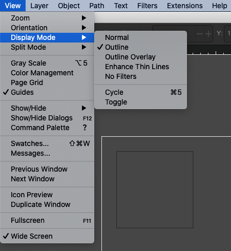
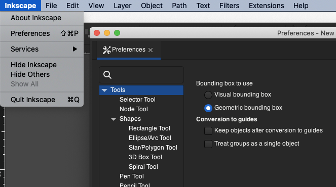
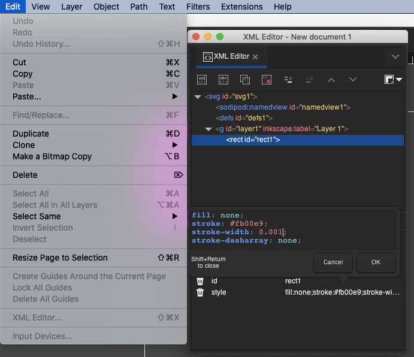

While working on [Grandbot](https://github.com/handeyeco/Grandbot), I had the idea that I would laser cut acrylic for a make-shift enclosure. I'm no fan of Adobe and their business model (so Illustrator was out) and most of the alternatives were also prohibitively expensive, so I landed on [Inkscape](https://inkscape.org/): an open-source vector illustration software.

The software is meant to be for making art and several people online said that using Inkscape for precision work would end in heartache. However I found a few tricks that helped during the process and I'm happy to say that I've designed several acrylic enclosures using Inkscape without any issues.

My local library has an Epilog Zing 24 so I figured I'd use that. The PCB was designed in another wonderful open source software called [KiCad](https://www.kicad.org/); I used its measuring tool to figure out where all my cuts would need to be.

I just needed to learn a couple things about Inkscape and start drawing.

## Display Mode

The way to tell the Epilog Zing to cut (vs engrave) is to set the stroke-width to 0.001. Unfortunately this makes it virtually impossible to see the design (since the lines were too small).

Setting `View > Display Mode > Outline` allows me to see the lines of my design regardless of how small the lines are.

## Bounding Box

I'm not sure the bounding box setting made a huge difference, but I thought it was worth mentioning. What this does is change the reference point for where you're positioning elements: visual bounding box includes the stroke width in calculating a shape's position whereas geometric bounding box does not.

If you're positioning things before changing the stroke width and getting confused as to why your x/y position is changing, it's probably because you need to switch to geometric bounding boxes.

`Preferences > Tools > Bounding box to use`

## XML Editor

No matter what I did, the stroke never really ended up being exactly 0.001. Luckily SVG is just XML and XML is relatively straight-forward to edit manually.

To view the SVG output, you can go to `Edit > XML Editor...`. Digging through the markup will show you the individual elements and their styles. Inkscape also seems to save things as SVGs which you can open in a text editor. Personally I opened the SVG in VS Code and did a find-and-replace: something like find (regex) `stroke-width="\d\.?\d"` replace `stroke-width="0.001"`.

## Conclusion

That's it for now. It was otherwise pretty straight-forward to design my stuff in Inkscape and the laser cutting worked without a hitch. Very grateful to the maintainers and contributors of Inkscape and thrilled to live in a world where we have these tools freely available to us. Also very grateful to my local library for having a freggin' laser cutter available!