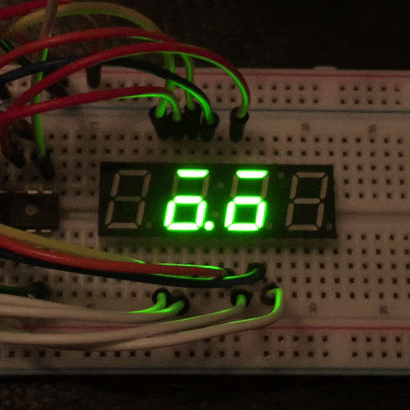
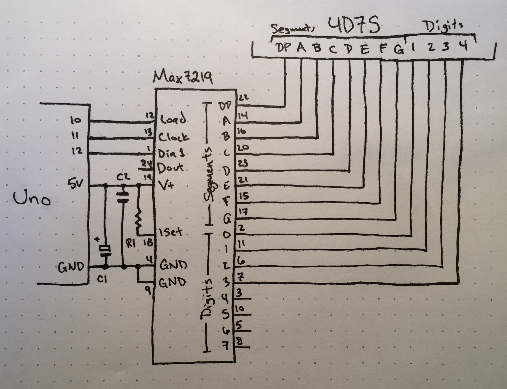

_**Disclaimer:** I don't know what I'm talking about. I'm a JavaScript dev who's just learning this stuff too. I'm sharing what I **think** I learned, but that doesn't make it the truth._

_Project originally inspired by the work of [Mohit Bhoite](https://twitter.com/MohitBhoite)._

In my last [post](https://handeyeco.github.io/tech-blog/seven-segment-emoji/) on 4-digit, 7-segment displays, I realized I would need help multiplexing if I wanted to free up the Arduino to do more complex things (like using sensors and changing expressions). In the end I decided to use the Max7219 display driver and the LedControl Arduino library.

The Max7219 is a chip specifically designed to control LED matrices. It replaces the shift register, transistor driver circuits, and limiting resistors I used in the last 4D7S build. It also handles multiplexing so the Arduino doesn't have to. Arduino has a great [resource on using the Max7219](https://playground.arduino.cc/Main/MAX72XXHardware/); I'd recommend starting there if you're interested in using the Max7219.

## The Build


<figcaption>Schematic of the build</figcaption>

### Components

I believe you could use any common cathode display, but be sure to check the display's datasheet for forward voltage and DC forward current. Use those two values in the chart in the Max7219 datasheet to get the appropriate value for R1.

- Arduino Uno R3
- TDCG1060M common cathode 4-digit, 7-segment (4D7S) display
- Max7219
- 10uF electrolytic capacitor (C1)
- 0.1uF ceramic capacitor (C2)
- 22k ohm resistor (R1)

#### Component notes

- Max7219
  - As mentioned above, it's a chip that's specifically designed to drive a bunch of LEDs (up to 64 per chip).
  - I believe Dout (pin 24) is used to chain several Max7219s together. Wasn't needed in this case.
  - I only used the first four digit pins. With all eight, you'd be able to control two 4D7S displays.
  - Both grounds need to be connected.
  - Just like the 74HC595, we're using serial communication with the Load (12), Clock (13), and Din (1) pins. Doesn't matter which Arduino pins you connect them to as long as you update the code.
- The capacitors are required by the Max7219 datasheet. They clean power-supply ripple...though I'm not 100% sure what that means.
- My understanding of the ISET resistor is that it limits the current going out to the LEDs. As mentioned above, the value depends on the 4D7S display being used.

### Code

``` arduino
#include "LedControl.h"

// Arduino Pins
int dataPin = 12;
int clockPin = 11;
int loadPin = 10;

/* 
 * Initialize the LedControl object
 * it will set the pin directions for us
 * and provide us with controls for the Max7219
 */
LedControl lc = LedControl(dataPin, clockPin, loadPin, 1);

// Gives us a future timestamp
// between 2 and 10 seconds in the future
int getNextBlink() {
  return millis() + random(2000, 10000);
}

// Random blink length between 100 and 300 ms
int getBlinkLength() {
  return random(100, 300);
}

// State
int nextBlink = getNextBlink();
int blinkLength = getBlinkLength();
boolean isBlinking = false;

// Expressions:
// 1 byte/digit describing segment data
int forward[4] = {
  B00000000,
  B11011101,
  B01011101,
  B00000000
};

int blinking[4] = {
  B00000000,
  B10001000,
  B00001000,
  B00000000
};

void writeExpression(int expr[4]) {
  // For each digit in the display...
  for (int i = 0; i < 4; i++) {
    // ...send that digit's segment data
    lc.setRow(0, i, expr[i]);
  }
}

void setup() {
  /*
   The MAX72XX is in power-saving mode on startup,
   we have to do a wakeup call
   */
  lc.shutdown(0, false);
  /* Set the brightness to high */
  lc.setIntensity(0, 14);
  /* Only scan the first 4 digits */
  lc.setScanLimit(0, 3);
  /* Clear the display */
  lc.clearDisplay(0);
}

void loop() {
  int now = millis();
  
  /* 
   * If not blinking, but should be
   * start blink
   */
  if (!isBlinking && now > nextBlink) {
    isBlinking = true;
    writeExpression(blinking);
  }
  
  /*
   * If blinking, but we passed the blink length
   * end blink and set next blink times
   */
  else if (isBlinking && now > nextBlink + blinkLength) {
    isBlinking = false;
    writeExpression(forward);
    nextBlink = getNextBlink();
    blinkLength = getBlinkLength();
  }
}
```

#### Code notes

I used the [LedControl library](https://github.com/wayoda/LedControl). I actually started writing my own code for the Max7219 since I wasn't using a lot of the features in the LedControl lib, but eventually I realized I had rewritten almost every function provided by that lib. I learned a lot in the process but ultimately decided not to reinvent the wheel.

Most of the code is initializing the Max7219 and creating helper functions for improved readability. The basic idea is simple:

```
- Create a future timestamp to determine when to blink
- Create a random blink length
- When we pass the timestamp, start blinking
- When we pass the timestamp + blink length, stop blinking
- Repeat
```

We want to keep track of whether we're blinking or not so we only send data to the Max7219 when we need to.

The only other weird part is the expressions. In my last 4D7S post, I talked about using 8 bits (a byte) to represent the state of each LED in a digit (7 segments + the decimal point). Since we have four digits, we use four bytes per expression. So:

``` arduino
int forward[4] = {
  B00000000, // blank
  B11011101, // small circle w/ eyebrow (decimal point)
  B01011101, // small circle w/ eyebrow (no decimal point)
  B00000000  // blank 
};
```

The difference from the last 4D7S post is that the Max7219 expects the decimal point first rather than last:

```
B 0 0 0 0 0 0 0 0
 DP A B C D E F G
```

Then we just iterate over the expression, setting each digit to each byte in order. This is done in `writeExpression` using the LedControl `setRow` function (if you think of the LEDs as being in a matrix, each digit is a row).

## Conclusion

This was a fun extension to the last project and freed up even more Arduino pins for other things. My next step is to extract some of the expression logic into a class, add more expressions, and add some sort of sensor to determine which expression should show. I also plan to add a buzzer so it can start making cute sounds.

Unfortunately it wasn't all good news. For awhile I thought I had a hardware issue (it was actually a software issue before I started using the LedControl lib) and while tracking down the source of the bug I burnt out my original 4D7S display. It's sad to lose a friend, but it will always be remembered. RIP.