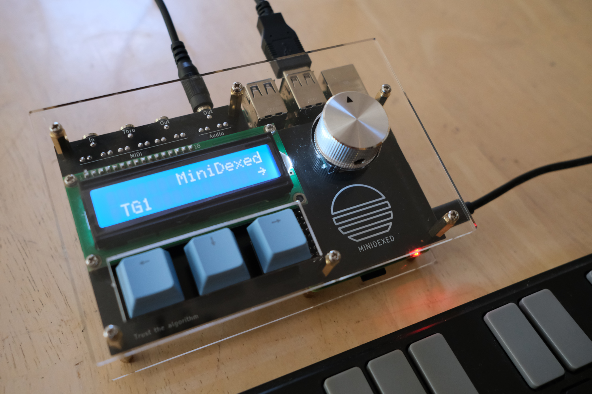

_**Disclaimer:** I don't know what I'm talking about. I'm a JavaScript dev who's just learning this stuff too. I'm sharing what I **think** I learned, but that doesn't make it the truth._

## Introduction

_[Link to the source files for the MiniDexed PCB.](https://github.com/handeyeco/minidexed-pcb)_

[MiniDexed](https://github.com/probonopd/MiniDexed) is a port of the open-source [Dexed synth VST](https://asb2m10.github.io/dexed/) (which itself is modeled after the [Yamaha DX7](https://en.wikipedia.org/wiki/Yamaha_DX7) 6-operator FM synth) to bare-metal Raspberry Pi. I have no involvement with the development of MiniDexed, but the project piqued my interest and I decided to try building one myself.

Unfortunately, the hardware requirements aren't very straight-forward: some people use 3 buttons, some use 5, and some use 0; you can use a USB audio interface or an external DAC or the built-in audio out (but only on RPi 4); hardware MIDI is optional, but there's some debate what schematic works the best; etc. It's designed to be customizable, but for beginners this might lead to analysis paralysis.

Additionally there often seemed to be a mashup of custom PCBs ([diyelectromusic](https://diyelectromusic.com/) is the mecca for resources on those) and off-the-shelf modules. This felt a little too haphazard for my OCD, so I set out to build my own PCB.

## Project Goals

- I wanted as much as possible baked into the PCB. An LCD and Raspberry Pi hanging off were fine, but I wanted the main I/O firmly latched onto the PCB.
- I wanted good, built-in sound. This meant using a DAC for the audio.
- I wanted built-in MIDI in/out/thru just because it's nice to have.
- I wanted an LCD for the screen (vs a tiny OLED) and buttons/encoder for input.
- I didn't want to commit to doing a lot of work in MiniDexed code.
- Size wasn't a huge factor, but I wanted it to be around the size of a [ShieldXL](https://github.com/okyeron/shieldXL).

One of the big deciding factors to how I approached this was the DAC. Increasingly DACs are hard to come by as THT components and the MiniDexed project seemed to be biased towards the SMT PCM5102A. Having never soldered SMT components, I decided this would be a good opportunity to try out a PCB assembly (PCBA) service. Overall it was a great success and having this skill really opens up the types of ICs I have access to in projects.

---

From here I'll go over the schematics and then talk about the manufacturing process. Where possible, I tried to conform to the recommendations on the [MiniDexed Hardware](https://github.com/probonopd/MiniDexed/wiki/Hardware) page.

## Audio out (DAC)

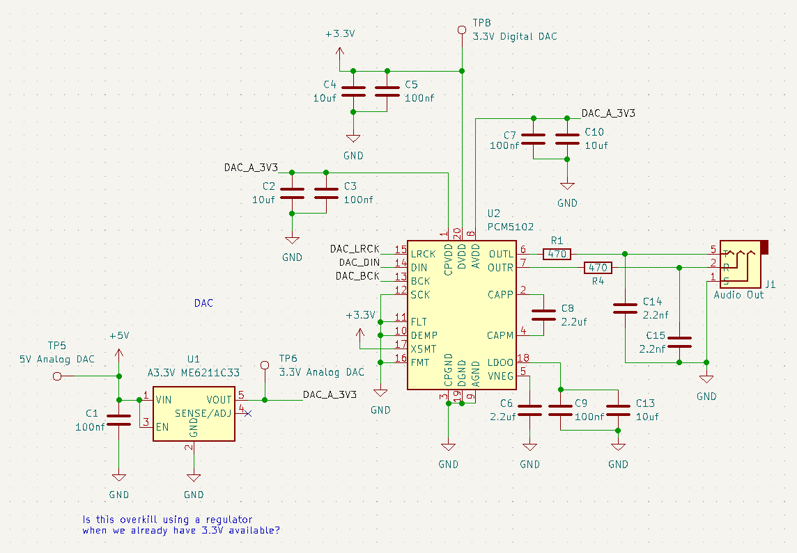

The audio circuit is based around the PCM5102A DAC. The MiniDexed project recommends some cheap modules you can find on Amazon/eBay/Alibaba/wherever, so that's where I looked first. There's a great writeup about this module on [todbot](https://todbot.com/blog/2023/05/16/cheap-stereo-line-out-i2s-dac-for-circuitpython-arduino-synths/) which itself references [macsbug](https://macsbug.wordpress.com/2021/02/19/web-radio-of-m5stack-pcm5102a-i2s-dac/). The important part is this schematic:

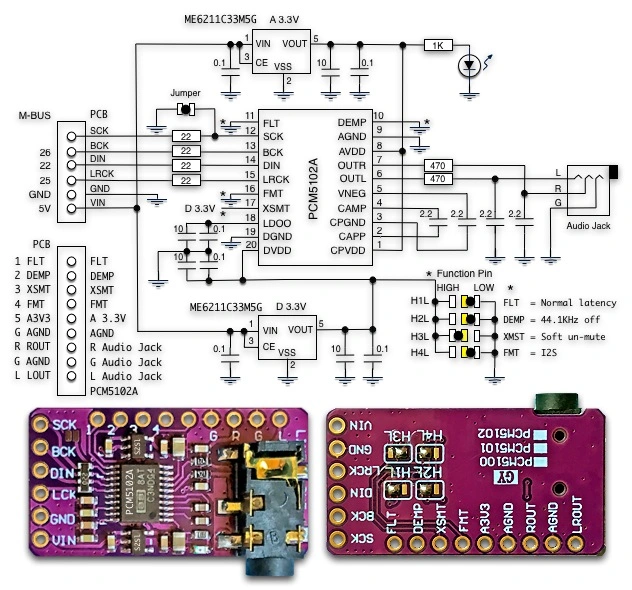

This module included a bunch of stuff I didn't need:

- It supports both 5V and 3.3V and separates analog from digital circuits, so it uses two voltage regulators (the ME6211C33MSG)
- It has a bunch of jumpers to configure things that I didn't care about
- It exposes a bunch of pins that I didn't need exposed
- It has an LED which I didn't want

Also looking at the "Typical Applications" schematic in the [PCM5102A datasheet](./pcm5102a.pdf) shows a similar (and luckily pared down) schematic:

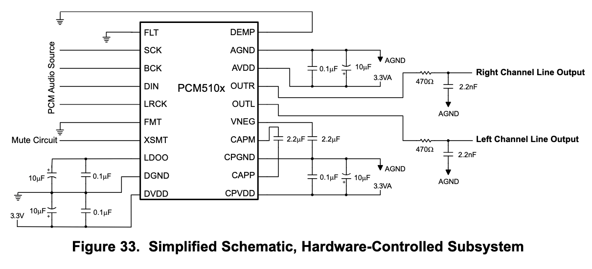

So I essentially just merged the two schematics I found. Overall, my understanding of what my final circuit is doing:

- Hard codes the DAC configuration: FLT, DEMP, XSMT, FMT
- Runs 5V through a ME6211C33 for the analog 3.3V  to keep noise down (the digital 3.3V is just from the RPi)
- Kickback resistors for the I2S lines (shown in the RPi schematic since they need to be near the source)
- I believe those are RC filters on the audio output
- I believe the remaining capacitors are bypass caps

## MIDI IO

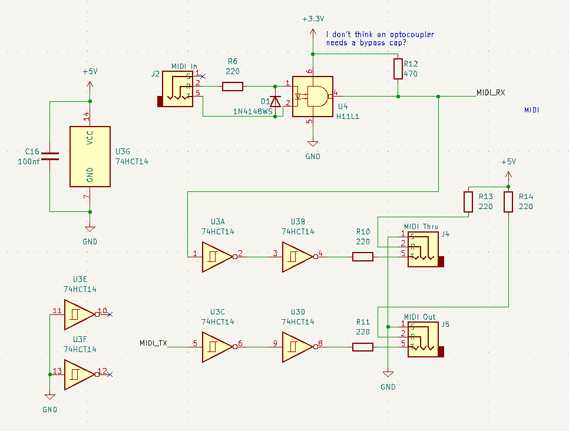

The MIDI spec requires an optocoupler on MIDI inputs (H11L1) and MIDI thru needs to be buffered (74HCT14). Since the 74HCT14 has 6 inverters and I only needed 2 for MIDI thru, I buffered the output too. Like the DAC circuit, this circuit is also a merger of a couple of schematics.

MIDI in is derived from the [MiniDexed hardware page](https://github.com/probonopd/MiniDexed/wiki/Hardware#classic-midi-input):

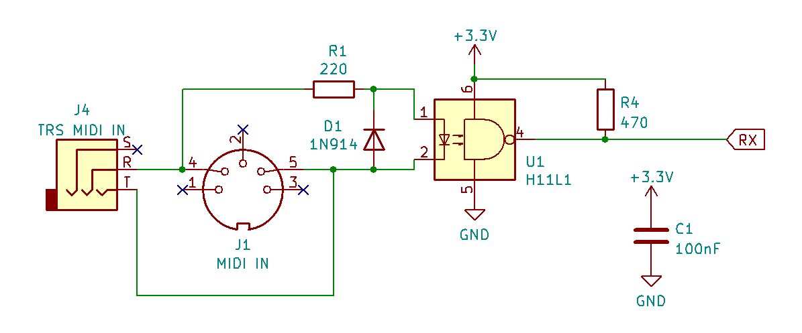

I think I also referenced [Dr. Scott M. Baker](https://www.smbaker.com/raspberry-pi-midi-hat-building-a-raspberry-pi-midi-jukebox), though most MIDI thru/out schematics you find online are roughly the same:

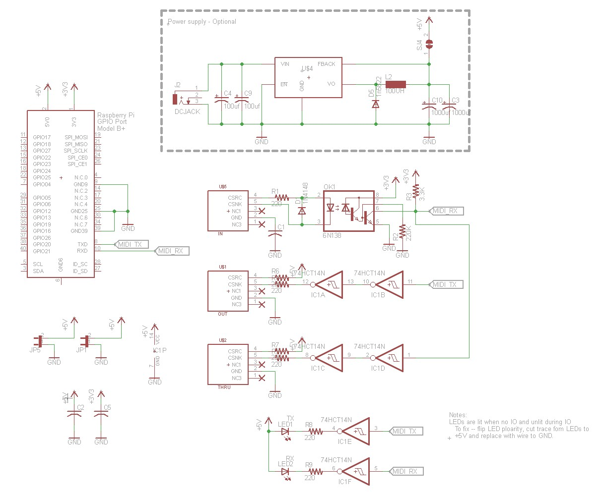

I know it's a controversial take, but I prefer TRS MIDI over DIN MIDI. I think DIN is better when performing or if you keep your stuff plugged in long-term, but I don't perform and I don't keep my stuff plugged in. Also these days it's super easy to find cheap, used 3.5mm aux cables. The jacks are also smaller and cheaper.

My limited understanding of the schematic:

- Resistors are limiting current
- Diode protects against reverse polarity
- Optocoupler protects against ground loops
- Buffer makes sure the digital signals have sharp edges

## Interface

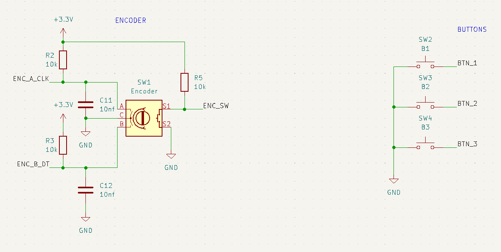

MiniDexed just recommends a modified KY-040 encoder. From the MiniDexed hardware page: "To improve precision, solder in 2 10nf capacitors: CLK to ground and DT to ground."

So pretty much it's just:

- 3 pullup resistors on the encoder (I maybe could have just used the internal pullups, but I was trying to conform with the module MiniDexed expects to avoid having to change the MiniDexed software)
- 2 caps which I think are acting as bypass caps? Or maybe debouncing caps?
- The buttons are just using internal pullups

No major innovations here.

## Screen

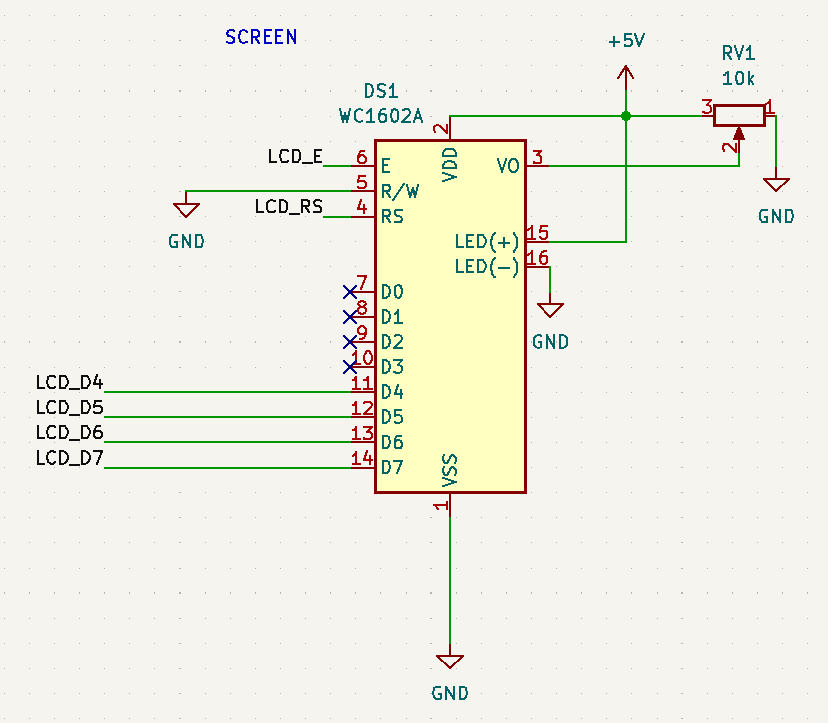

[Here's MiniDexed's information on the LCD.](https://github.com/probonopd/MiniDexed/wiki/Hardware#pinout) Nothing really innovative here either. I could have used an LCD with an I2C backback or I could have reverse-engineered the components on one of the [common 16x2 modules](https://www.adafruit.com/product/181), but I went with the middle ground: use a module, but a fairly generic one.

The trim pot controls the screen's contrast. I think it might be backwards but it works.

## Raspberry Pi

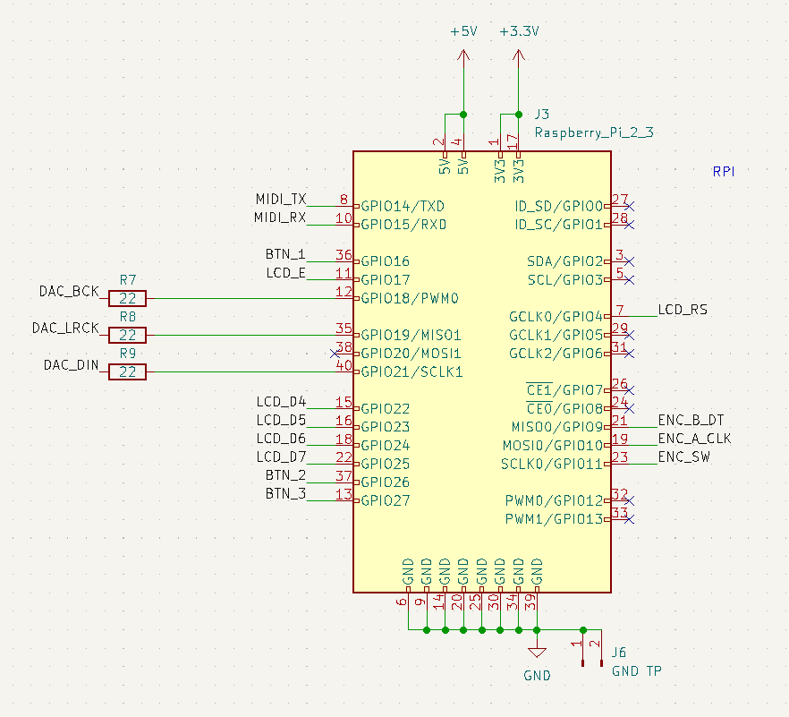

The only things interesting here are the kickback resistors for the I2S signal to the DAC. I read that they're supposed to be close to the sending side of the signal, so that's why they're part of the RPi side of things.

---

## Manufacturing Notes

- When laying out the PCB, I took a lot of care to try and separate the audio out functionality from the rest of the board to avoid noise from digital signals
- I used JLCPCB's PCBA service. The boards cost $9 for 5 and the assembly (which included the SMT components) cost $57 for 5; so about $13/ea before shipping.
- Overall going through the process of making pick-and-place files was straight-forward. I _almost_ made a mistake by using an incorrect footprint, but caught it while triple-checking everything. [Notes and Volts have an instruction video](https://www.youtube.com/watch?v=VejO8rDdhzo) on designing a PCB for pick-and-place assembly.
- Originally I tried panel mount Cherry switches because that's what I had. PCB mount switches look and feel **much** nicer.
- Originally I used an RPi 4 but it was concerningly hot so I downgraded to a 3.
- To keep the height down I soldered the LCD directly into the PCB rather than use headers. I hope I don't come to regret this.
- I ended up laser-cutting some acrylic panels for the top/bottom. It's the `acrylic-faceplates.svg` file in the repo, but they might need tweaking depending on the laser cutter.

Things I would change:

- I need to redo my 3.5mm jack footprint. The jacks have two plastic legs that I think are meant to brace the jack when plugging/unplugging, but I originally thought they were little standoffs so I didn't make holes for them.
- Figure out how to keep the height low without soldering the LCD into the PCB.

## Conclusion

That's all I can think of. I had to make some modifications to the MiniDexed config, but that's outlined on [the Github page for the PCB](https://github.com/handeyeco/minidexed-pcb). Overall pleased with the sound of this thing and happy that I didn't make any major mistakes on my first PCBA project.

Anyway, thanks to all the folks who have contributed to the Dexed/MiniDexed lineage; it's wonderful to see so many people come together to make cool, open-source music projects.

## Random Pictures

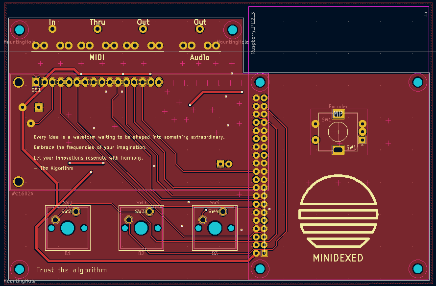

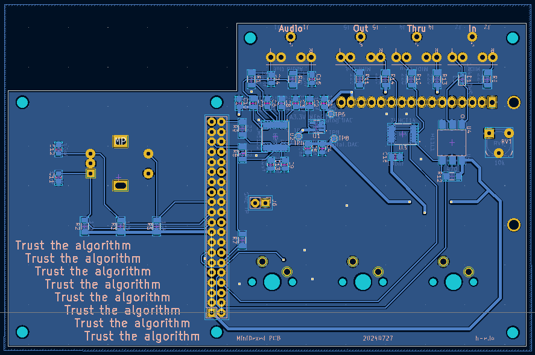

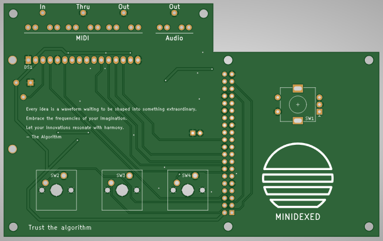

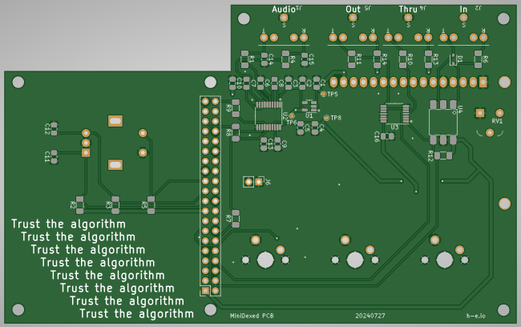

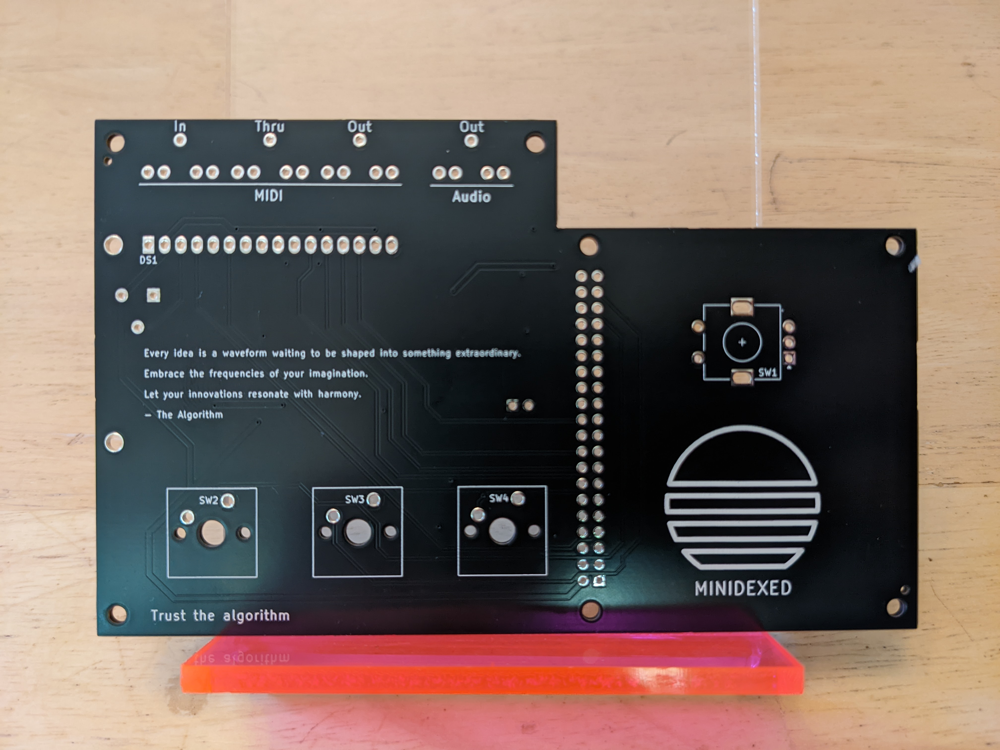

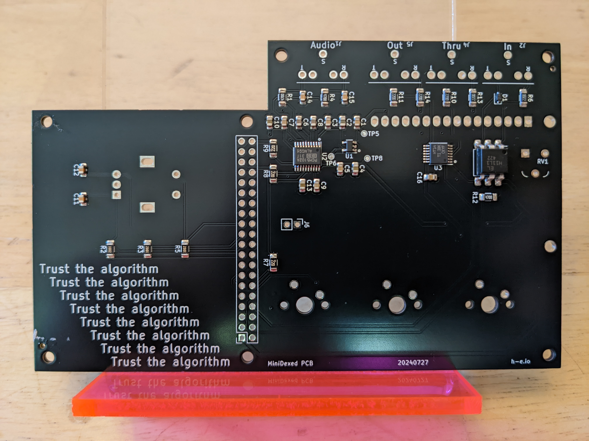