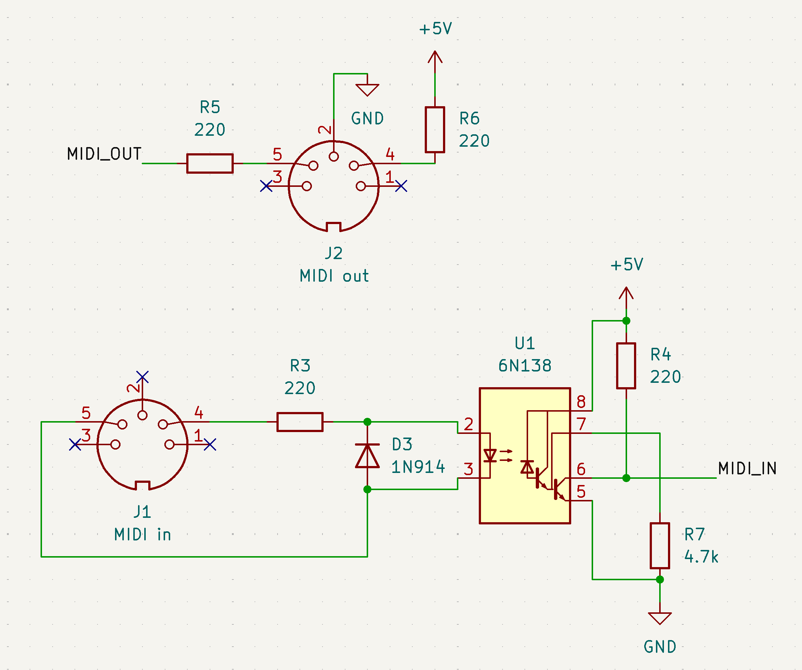

_**Disclaimer:** I don't know what I'm talking about. I'm a JavaScript dev who's just learning this stuff too. I'm sharing what I **think** I learned, but that doesn't make it the truth._

**I have not succeeded, this is a WIP and might never be finished. Please let me know if you make more progress than I did.**

## The Goal

If you've ever read anything on this blog, it's obvious I'm going through a MIDI phase right now. After working for awhile on [Grandbot](https://github.com/handeyeco/Grandbot), I've started thinking about what I want to do next and I was thinking of a MIDI utility tool.

One Saturday morning I was reading about Mutable Instrument's [Midipal](https://pichenettes.github.io/mutable-instruments-diy-archive/midipal/manual/) and realized the microcontroller used was an ATmega328P, the same MCU as the Arduino Nano (and Arduino Uno). I had an extra 16x2 display from working on the [MiniDexed PCB](https://github.com/handeyeco/minidexed-pcb) and some leftover Nanos from working on Grandbot, so I thought it would be a fun weekend project to try and get Midipal running on a Nano.

I wanted to share my findings so that SynthDIY newbies would have an easy project to build (had I succeeded, which I didn't).

## The Schematic

I couldn't actually open the Midipal schematics because they're EAGLE files. I ended up looking at the schematics of forks and reading through the code for the pins. Here's what I came up with.

The main UI schematic:


This is roughly the MIDI schematic (not exact, I just have a stripboard with everything I need for Arduino MIDI on it and I don't remember the exact values):



## Getting Started

First `git clone https://github.com/pichenettes/midipal`.

`.gitmodules` needs to be updated to use `https://` urls instead of `git://` urls:

```
[submodule "avrlib"]
	path = avrlib
	url = https://github.com/pichenettes/avril.git
[submodule "tools"]
	path = tools
	url = https://github.com/pichenettes/avril-firmware_tools.git
```

Then:

- `git submodule init`
- `git submodule update`
- `make`

## Problem: CrossPack and Microchip Technology's Acquisition of Atmel

[CrossPack-AVR](https://github.com/obdev/CrossPack-AVR) seems to have been a helper for fetching the AVR toolchain. It hardcodes the location of the distribution to `http://distribute.atmel.no/tools/opensource/Atmel-AVR-GNU-Toolchain/$atmelToolchainVersion`. However Atmel was aquired by Microchip Technologies and that link no longer works.

You can see in Midipal what dependencies we wanted:

```
// makefile.mk

CC             = $(AVRLIB_TOOLS_PATH)avr-gcc
CXX            = $(AVRLIB_TOOLS_PATH)avr-g++
OBJCOPY        = $(AVRLIB_TOOLS_PATH)avr-objcopy
OBJDUMP        = $(AVRLIB_TOOLS_PATH)avr-objdump
AR             = $(AVRLIB_TOOLS_PATH)avr-ar
SIZE           = $(AVRLIB_TOOLS_PATH)avr-size
NM             = $(AVRLIB_TOOLS_PATH)avr-nm
AVRDUDE        = $(AVRLIB_TOOLS_PATH)avrdude
```

If you have the Arduino IDE installed, you should pretty much have all this stuff on your computer already. Unfortunately it's probably not the `3.5.4` version of the toolchain that Midipal uses.

What I ended up doing was `brew install avrdude`, downloaded the `3.7.0` toolchain [from here](https://www.microchip.com/en-us/tools-resources/develop/microchip-studio/gcc-compilers), updated the `makefile.mk` to point to the directory with the `3.7.0` toolchain, and made a small tweak to `makefile.mk` for `avrdude`:

```
- AVRDUDE        = $(AVRLIB_TOOLS_PATH)avrdude
+ AVRDUDE        = avrdude
```

At this point I got a little further with `make` except after that I was getting compilation errors due to incompatibilities between the 3.5.4 and 3.7.0 toolchains. I needed to change a few things in the code:

```
// >> midipal/resources.h

- extern const prog_char* string_table[];
+ extern const prog_char* const string_table[];

- extern const prog_uint16_t* lookup_table_table[];
+ extern const prog_uint16_t* const lookup_table_table[];

// >> midipal/resources.cc

- PROGMEM const prog_char* string_table[]
+ const prog_char* const string_table[] PROGMEM

- PROGMEM const prog_uint16_t* lookup_table_table[]
+ const prog_uint16_t* const lookup_table_table[] PROGMEM

// >> avrlib/devices/pot_scanner.h

+ #include <string.h>
```

At this point I think things were basically compiling.

## Problem: the Clock

While debugging issues, someone on Reddit pointed out a possible problem that I was going to have: Midipal was using a 20Mhz clock and the Nano uses a 16Mhz clock. I'm not totally sure how big of an impact that would have but the Midipal code does make a couple of references to the fact that the clock is running at 20Mhz, so I imagine it would have _some_ impact.

## Problem: the Bootloader

One of the big things I learned while doing this is that you can't program the 328's bootloader over USB. The bootloader is the code that runs when the microcontroller boots and I believe that it needs to be written to the microcontroller via ICSP.

Why does the bootloader matter? It's my understanding that the bootloader is what helps the Arduino accept firmware over USB and the Midipal's bootloader cleverly accepts firmware via MIDI. Put a different way, this is what lets Midipal accept alternative firmware over MIDI.

Unfortunately this makes having the full Midipal experience on the Nano much more difficult: people would need an ICSP programmer or a second Arduino that could work as an ICSP programmer.

On top of this, Midipal is manipulating the fuses on the 328. **This makes the whole thing a lot more risky to newbies because a simple mistake could brick the MCU.**

## Installing the firmware without the bootloader

Just out of curiosity though, I pressed on. At this point I had a `midipal.hex` (which I believe is the firmware) and `muboot.hex` (which I think is the bootloader), so I thought: why don't I just try to send the firmware to the Arduino without the bootloader and see what happens?

I made a test script in the Arduino IDE, turned on "show verbose output during compile and upload" in the settings, and sent the script to the Nano. That gave me a command that I then modified to point at `midipal.hex`:

```
"/Users/me/Library/Arduino15/packages/arduino/tools/avrdude/6.3.0-arduino17/bin/avrdude" /
    "-C/Users/me/Library/Arduino15/packages/arduino/tools/avrdude/6.3.0-arduino17/etc/avrdude.conf" /
    -v -V -patmega328p -carduino "-P/dev/cu.usbserial-310" -b115200 -D /
    "-Uflash:w:/Users/me/code/_backups/mutable-instruments/midipal/build/midipal/midipal.hex:i"
```

Surprisingly...that kinda worked...in the sense that the display was showing the Midipal UI and the encoder navigated around. It's pretty janky and it's not handling MIDI correctly - maybe having to do with the clock? It receives and sends MIDI, but the MIDI it's sending is random/erratic. To be honest, I was shocked to get this far.

## Where things stand

- I'm not convinced this will ever work at all due to the clock (without maintaining a fork of the repo)
- Some of the fun features of Midipal depends on a custom bootloader, so I don't think this would be a good beginner project
- [Gizmo](https://cs.gmu.edu/~sean/projects/gizmo/) exists, is easy to make, and is probably more feature-rich than Midipal

I might keep hacking away at this just as a learning experience, but right now I'm considering this a failed project. It's important to share the failures too though! Hopefully it'll save someone some trouble.