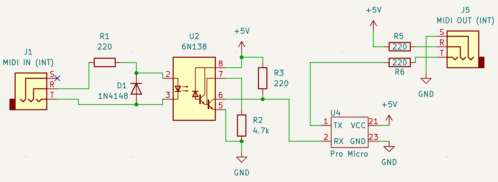

_**Disclaimer:** I don't know what I'm talking about. I'm a JavaScript dev who's just learning this stuff too. I'm sharing what I **think** I learned, but that doesn't make it the truth._

Quick note: diyelectromusic.com has [a bunch of writeups](https://diyelectromusic.com/2022/03/22/arduino-and-usb-midi/) on doing stuff like this, so those posts would be good references too.

---

It's been fun working with the [Denki Oto shield XL](https://www.denki-oto.com/store/p98/shieldXL_(DIY_norns_synthesizer_kit).html) - a small, scriptable computer for music and a clone of the [Monome Norns](https://monome.org/docs/norns/). As a programmer it's great to have an idea for some MIDI utility and, after a little bit of Lua programming, have the utility running on real hardware.

I found a deal on an older model Norns, so I decided to splurge on a fixer-upper; you can see [my video for that here](https://www.youtube.com/watch?v=3S8zLlK_vk0). While an authentic Norns has a lot of benefits over the shieldXL, one of the major problems with the Norns is that it doesn't have hardware MIDI I/O.

So I decided to tinker around to see if I could make a USB-to-TRS MIDI interface.

Goals:

- TRS MIDI since I want to use it for a portable rig and most of my small synths use TRS MIDI (FM2, NTS-1, S-1, Micromonsta, and [Grandbot](https://github.com/handeyeco/Grandbot))
- Small-ish, again since it's for a portable rig
- Ideally using stuff I had lying around the house

## Microcontroller

Not all microcontrollers are up for this task since they need to be able to act as a USB device, which disqualifies the trusty Arduino Uno and Arduino Nano.

Luckily I happened to have an unused [Pro Micro](https://www.sparkfun.com/pro-micro-5v-16mhz.html) lying around. They come in 5V and 3.3V variants, but I used the 5V for this one.

To be honest, using a Pro Micro is probably massive overkill for this project. I'm only using 4 of the 24 pins, so the dev board is probably 2x or even 3x the size of just embedding an MCU. For the price of a Pro Micro, I could buy a USB-to-DIN cable.

_However_, I haven't found a commercial USB-to-TRS interface, I already had the parts, and if I just bought something I wouldn't have been able to write this blog post.

## Schematic

If you've read any post on this blog, the schematic will likely bore you. If you haven't done a MIDI circuit before, [Notes and Volts has a good overview](https://www.notesandvolts.com/2015/02/midi-and-arduino-build-midi-input.html).



A typical MIDI input circuit attached to the Pro Micro's RX, a typical MIDI output circuit attached to the Pro Micro's TX, and power.

## The Code

The circuit was easy (I actually have an Arduino MIDI test circuit I keep around for this kind of experiment) but the code was a little trickier.

Some Arduino libraries I looked at:

- [Arduino MIDI Library](https://github.com/FortySevenEffects/arduino_midi_library): this is what I use for Grandbot. It deals with hardware MIDI.
- [MIDIUSB](https://github.com/arduino-libraries/MIDIUSB): this is the official library for MIDI over USB.
- [Arduino-USBMIDI](https://github.com/lathoub/Arduino-USBMIDI): this was built to act as an intermediary between the hardware and USB MIDI libraries.

Unfortunately in the short amount of time I looked at these I couldn't get them to play nice together. USBMIDI has an example called `MIDI_DIN2USB` which didn't work for me. Trying to connect the hardware MIDI library with the USB MIDI library was frustrating because the Arduino MIDI Library doesn't seem to expose the raw status byte, so I couldn't figure out how to just forward the raw data.

Eventually I ran into [Control Surface](https://github.com/tttapa/Control-Surface) which has a `USBMIDI-Adapter` example which worked for me:

``` cpp
#include <Control_Surface.h>

// Instantiate a MIDI over USB interface
USBMIDI_Interface midi_usb;
// Instantiate a 5-pin DIN MIDI interface (on the TX and RX pins of Serial1)
HardwareSerialMIDI_Interface midi_ser {Serial1};
// Instantiate the pipe to connect the two interfaces
BidirectionalMIDI_Pipe pipes;

void setup() {
  // Manually route MIDI input from the serial interface to the USB interface,
  // and the MIDI input from the USB interface to the serial interface
  midi_ser | pipes | midi_usb;
  // Initialize the MIDI interfaces
  MIDI_Interface::beginAll();
}

void loop() {
  // Continuously poll all interfaces and route the traffic between them
  MIDI_Interface::updateAll();
}
```

Very magical code to me, but it works.

## Conclusion

That's it! A microcontroller, a couple of common components, and a few lines of code!

Connecting the Pro Micro to the Norns provides power and sets up the USB connection. The device shows up as "Arduino Micro" in the Norns. Haven't spotted any issues, but some people talk about problems with SysEx when doing this kind of thing; I haven't tried that yet since that's not what I'm using this for.

I _did_ finally break last night and ordered a Zoom L6 which seems to have a USB-to-MIDI interface built in. I wanted something I could use to mix these synths but originally planned to DIY a small mixer; I still might because I want 3.5mm TRS audio I/O, but I'm moving so I don't have a lot of time to design/order PCBs for that. Plus the L6 has the MIDI...and can record...and has effects..and is pretty small...and it's not _that_ expensive...

Either way, this was a fun diversion. Hope this writeup helps. Happy hacking!