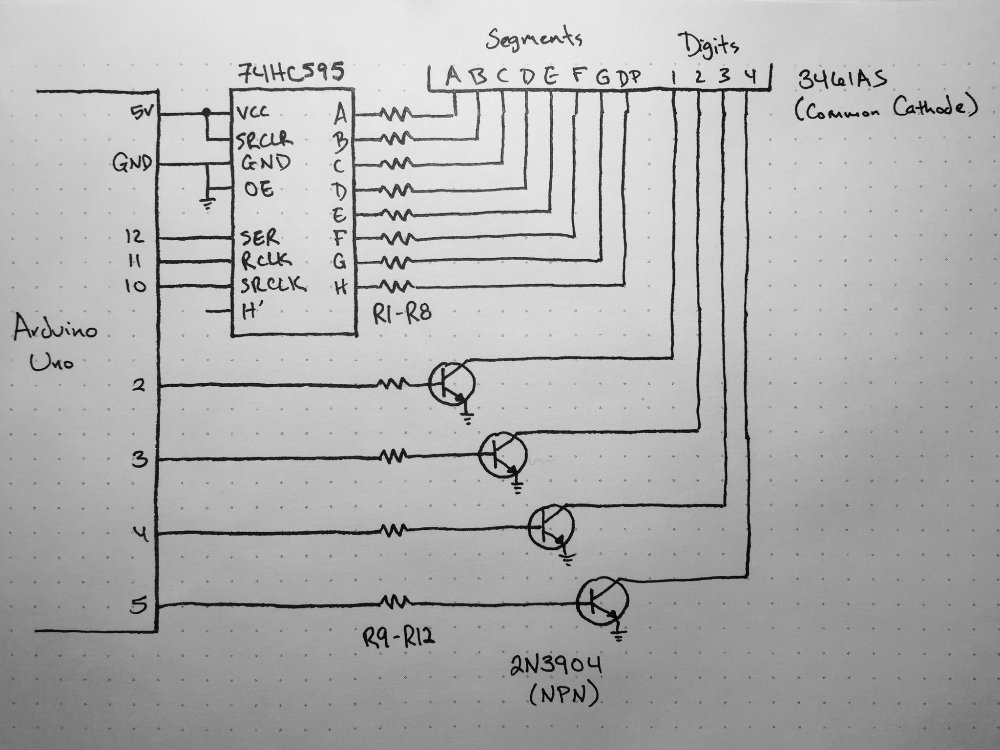

_**Disclaimer:** I don't know what I'm talking about. I'm a JavaScript dev who's just learning this stuff too. I'm sharing what I **think** I learned, but that doesn't make it the truth._

While at Eyeo Festival in 2019, I had the chance to hear [Mohit Bhoite](https://twitter.com/MohitBhoite) [talk](https://vimeo.com/354276626) about the beautiful freeform, electronic sculptures he creates. With just a few commonly found components and a microcontroller, he's able to craft whimsical and charming creations that really resonated with me. The project that spoke to me the most was his [Chintoo](https://twitter.com/MohitBhoite/status/1241752124087660546) project, and I started to think "hey, I could make that! How hard could 4-digit, 7-segment displays be?"

Apparently they're pretty tricky. While this isn't meant to explain 4-digit, 7-segment displays (that's been covered extensively), hopefully this will augment existing resources that gloss over some things that tripped me up. I'm going to show off what I built and talk a little about what I learned afterwards.

## The Build


<figcaption>Schematic of the build</figcaption>

### Components

This is what I used. I'm sure you can swap out any of these parts, but this is what worked for me. The schematic I posted is written for simplicity, you'll need to read the datasheets for the components you use to determine which pin is which.

- Arduino Uno R3
- 3461AS common cathode 4-digit, 7-segment (4D7S) display
- 74HC595 shift register
- x4 2N3904 NPN transistors
- x8 220 ohm resistors (R1-R8)
- x4 1k ohm resistors (R9-R12)

#### Component notes

- Display
  - The 4D7S display I'm using actually has 8 segments per digit (with the addition of the dot).
  - Multiplexing is required for 4D7S displays or otherwise they would need a minimum of 28 pins. Multiplexing just means we're lighting one digit at a time so fast that it seems like they're all lit at once.
- Shift register
  - I have no doubt this can be done without the shift register (using Arduino outputs to drive the segment state), but it'd use more pins and the code would be a little more verbose.
  - The shift register takes serial data representing which pins on the chip should be on/off. So when I use Arduino's builtin `shiftOut` function with `shiftOut(dataPin, clockPin, LSBFIRST, B11000000)`, A and B will be HIGH while C thru H will be LOW. `LSBFIRST` seems to specify order. `shiftOut(dataPin, clockPin, MSBFIRST, B00000011)` would be the same.
  - `SRCLR` clears the shift register. I couldn't get `SRCLR` working and it turns out I didn't need it anyway. If unused, it needs to be connected to `Vcc`; otherwise it'll be floating and you'll see irregular flickering.
  - I don't know what `OE` is, but all the examples connected it to `GND` so that's what I did too.
  - The unused `Qh` is for chaining shift registers, which I didn't need to do.
- Other components
  - A lot of examples omit the current limiting resistors, but it seems like you'd run the risk of blowing out an LED, transistor, or an Arduino I/O pin. [This](https://www.onetransistor.eu/2018/12/wiring-of-4digit-7segment-display.html) article was really helpful.
  - The transistors amplify current so that there's enough to evenly light up the digits. For instance if there's not an optimal amount of current and one digit has one segment lit while another digit has every segments lit, the digit with one segment lit will be brighter.
  - I'm not sure if I picked the best resistor values, that's why I didn't write them in the schematic. I know I should be able to do the math, but I couldn't figure out how to get all of the values I needed for the formula.

### Code

``` arduino
// Digit selection to 4D7S
int digit1 = 2;
int digit2 = 3;
int digit3 = 4;
int digit4 = 5;

// Serial to shift register
int clockPin = 10;
int latchPin = 11;
int dataPin = 12;

void setup()
{
  // Initialize pins out outputs
  pinMode(digit1, OUTPUT);
  pinMode(digit2, OUTPUT);
  pinMode(digit3, OUTPUT);
  pinMode(digit4, OUTPUT);

  pinMode(clockPin, OUTPUT);
  pinMode(latchPin, OUTPUT);
  pinMode(dataPin, OUTPUT);
}

void display(int digit, int segmentData)
{
  // Disable all digits
  digitalWrite(digit1, LOW);
  digitalWrite(digit2, LOW);
  digitalWrite(digit3, LOW);
  digitalWrite(digit4, LOW);
  
  // Set segment data with shift register
  digitalWrite(latchPin, LOW);
  shiftOut(dataPin, clockPin, LSBFIRST, segmentData);
  digitalWrite(latchPin, HIGH);

  // Enable specified digit
  digitalWrite(digit, HIGH);

  // Wait a bit for increased brightness
  delay(5);
}

void loop()
{
  // Using binary to represent each segment
  // (1 = on, 0 = off)
  // should draw: O . o
  display(digit1, B11111100); // big circle
  display(digit2, B00000001); // just the dot
  display(digit3, B00000000); // blank
  display(digit4, B00111010); // little circle
}
```

#### Code notes

We're multiplexing, so the order of the code is important. I struggled for weeks trying to figure out why digits had a "ghosting" effect - meaning that they showed a dim residue of the shape from the previous digit. So in pseudocode the solution is:

```
- Initialize variables to help legibility
- Set the pins we're using as outputs
- Loop:
  - Turn all digits off
  - Load the next digit segment data into the shift register
  - Turn the next digit on
  - Delay for a few microseconds
  - Repeat
```

The binary is just a way of keeping track of what segment is on and which is off. You can use decimal or hexadecimal, but binary made the most sense to me. With `LSBFIRST` the order is: A-B-C-D-E-F-G-DP. So a big circle is `B11111100` or A1-B1-C1-D1-E1-F1-G0-DP0.

The delay is important and is a fine balance. Too small of a delay and the light won't be on long enough for it to register as being bright. Too large of a delay and you'll see the multiplexing in action. In fact it's a good experiment to tinker with it, just remember to turn it back.

## Conclusion

While frustrating at times, this was a very enlightening project. In the end, I realized that I would need to separate multiplexing logic from the logic that determines the facial expression if I hope to have the expression respond to things. It seems there are chips specifically designed for multiplexing and maintaining current display state - the Max7219 seems promising in this regard. Using a chip like that would allow the microcontroller to do more complex processes without interrupting the multiplexing.

Thanks for everyone who helped me! It actually took a number of people and just about every article on 4D7S with Arduino to get it through my thick skull. If I misspoke or just missed something, let me know!