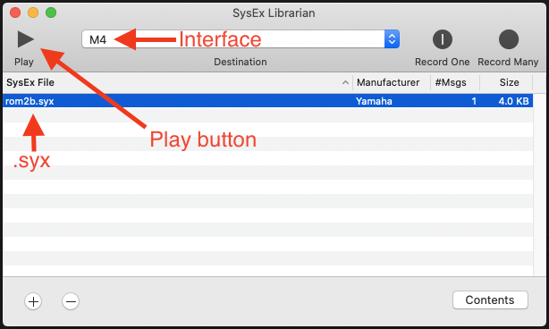

**Update 2024-12-14:** I thought it was weird that I couldn't find a web-based tool for sending SysEx, so I ended up making one: [SysEx Send](https://handeyeco.github.io/sysex-send/) ([Source](https://github.com/handeyeco/sysex-send)). The steps are basically the same as below except now you can use SysEx Send instead of SysEx Librarian.

---

**!! SENDING A CART WILL OVERWRITE THE PRESETS SAVED ON YOUR FM2 !!**

Korg flexes the FM2's compatibility with the DX7 quite a bit; right on the landing page for the FM2:

- _"completely compatible with SYS-EX patches for the DX7"_
- _"full classic Sys-Ex compatibility"_

However the manual is a bit more obtuse:

- _"sound files (SYS-EX/SYX) created on the Yamaha DX7 can be converted and loaded into the volca fm"_
- _"the MIDI IN jack can be used...to receive SYX (Yamaha DX7) sound data files"_

As I was writing an email to Korg I finally figured it out, and while it seems obvious now, I thought I'd share the process.

## tl;dr

Just send the cart SysEx using something like [SysEx Librarian](https://www.snoize.com/SysExLibrarian/).

1. Connect the FM2 to your MIDI interface
2. Download a cart
3. Drag it into SysEx Librarian
4. Hit the "Play" button
5. Go through the presets

It won't be immediately obvious that anything happened because the current patch is in memory and loaded from the previous cart. When you change patches you'll see the patches from the new cart.

## A little more in-depth

### 1. Connect the FM2 to your MIDI interface

Not all MIDI interfaces are created equally; the cheaper ones notoriously have trouble handling SysEx messages. MIDI interface out to FM2 MIDI in obviously.

### 2. Download a cart

This is about sending a full cart (32 presets as opposed to 1 preset) and there are plenty to choose from online. [Dexed](https://asb2m10.github.io/dexed/) comes with several and you can find a bunch at [Yamaha Black Boxes](https://yamahablackboxes.com/collection/yamaha-dx7-synthesizer/patches/). The file type must be `.syx`.

### 3. Drag it into SysEx Librarian

Download, install, and open [SysEx Librarian](https://www.snoize.com/SysExLibrarian/) on Mac ([MIDI-OX](http://www.midiox.com/) might be a good option for Windows, as recommended by [Sweetwater](https://www.sweetwater.com/sweetcare/articles/how-do-i-send-and-receive-sysex-on-pc-or-mac/#SysEx-MIDI-files-on-PC)). Drag the `.syx` file into SysEx Librarian and make sure it's set up to use your MIDI interface.

### 4. Hit the "Play" button

Top left corner, it's a big button that says "Play" on it. It'll take a second to send the SysEx. If you have an indicator on your MIDI interface you should see activity on that, but the FM2 doesn't hint that it's receiving MIDI.

### 5. Go through the presets

This is where I got confused. SysEx Librarian send the `.syx`, my MIDI interface showed that it was sending the `.syx`, but nothing happened on the FM2 - the patch I had loaded from the old cartridge was still loaded after sending the new cartidge.

I imagine what's happening is that the patch is loaded into memory and hangs around regardless of what cart is loaded. When you change the patch, it'll load them from the new cart and the in-memory patch will disappear.

## Bonus: some carts I found online

I like to mirror things in case sites go down.

- Finetales
    - [1: EPs and bells](./carts/finetales1.syx)
    - [2: plucks, basses, brass](./carts/finetales2.syx)
    - [3: strings, pads, etc](./carts/finetales3.syx)
- Yamaha Black Boxes
    - Factory
        - [ROM1A Master](./carts/rom1a.syx)
        - [ROM1B Keyboard & Plucked](./carts/rom1b.syx)
        - [ROM2A Orchestral & Percussive](./carts/rom2a.syx)
        - [ROM2B Synth, Complex & Effects](./carts/rom2b.syx)
        - [ROM3A Master](./carts/rom3a.syx)
        - [ROM3B Keyboard & Plucked](./carts/rom3b.syx)
        - [ROM4A Orchestral & Percussive](./carts/rom4a.syx)
        - [ROM4B Synth, Complex & Effects](./carts/rom4b.syx)
    - VRC Voice ROMs
        - [VRC101A Keyboard, Plucked & Tuned Perc.](./carts/vrc101a.syx)
        - [VRC101B Keyboard, Plucked & Tuned Perc.](./carts/vrc101b.syx)
        - [VRC102A Wind Instrument](./carts/vrc102a.syx)
        - [VRC102B Wind Instrument](./carts/vrc102b.syx)
        - [VRC103A Sustain](./carts/vrc103a.syx)
        - [VRC103B Sustain](./carts/vrc103b.syx)
        - [VRC104A Percussion](./carts/vrc104a.syx)
        - [VRC104B Percussion](./carts/vrc104b.syx)
        - [VRC105A Sound Effect](./carts/vrc105a.syx)
        - [VRC105B Sound Effect](./carts/vrc105b.syx)
        - [VRC106A Synthesizer](./carts/vrc106a.syx)
        - [VRC106B Synthesizer](./carts/vrc106b.syx)
        - [VRC107A David Bristow Selection](./carts/vrc107a.syx)
        - [VRC107B David Bristow Selection](./carts/vrc107b.syx)
        - [VRC108A Gary Leuenberger Selection](./carts/vrc108a.syx)
        - [VRC108B Gary Leuenberger Selection](./carts/vrc108b.syx)
        - [VRC109A Studio 64](./carts/vrc109a.syx)
        - [VRC109B Studio 64](./carts/vrc109b.syx)
        - [VRC110A Bo Tomlyn Selection](./carts/vrc110a.syx)
        - [VRC110B Bo Tomlyn Selection](./carts/vrc110b.syx)
        - [VRC111A Bo Tomlyn Selection II](./carts/vrc111a.syx)
        - [VRC111B Bo Tomlyn Selection II](./carts/vrc111b.syx)
        - [VRC112A Live 64 - Akira Inoue](./carts/vrc112a.syx)
        - [VRC112B Live 64 - Akira Inoue](./carts/vrc112b.syx)
    - GreyMatter E! Card
        - [Soundbank Disk #2](./carts/greymatter2.syx)
        - [Soundbank Disk #5](./carts/greymatter5.syx)
        - [Soundbank Disk #7](./carts/greymatter7.syx)